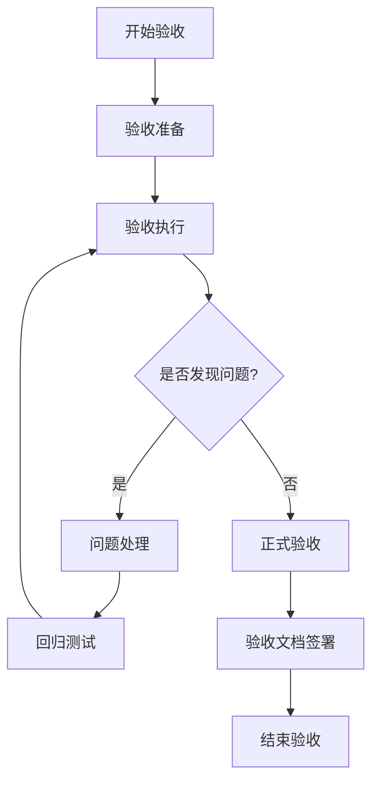
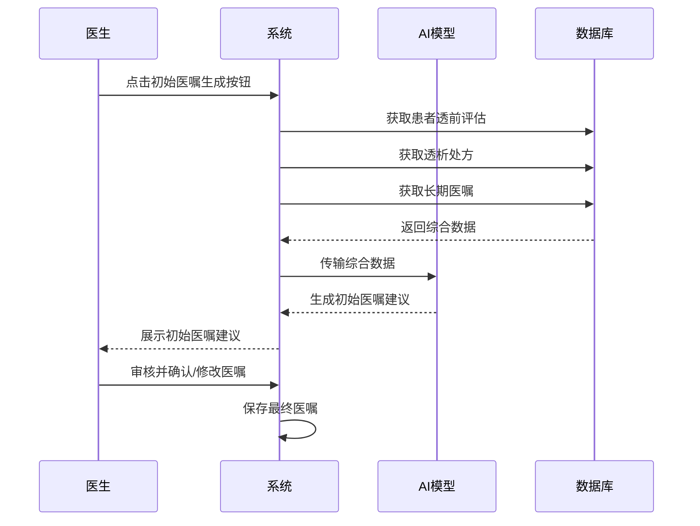
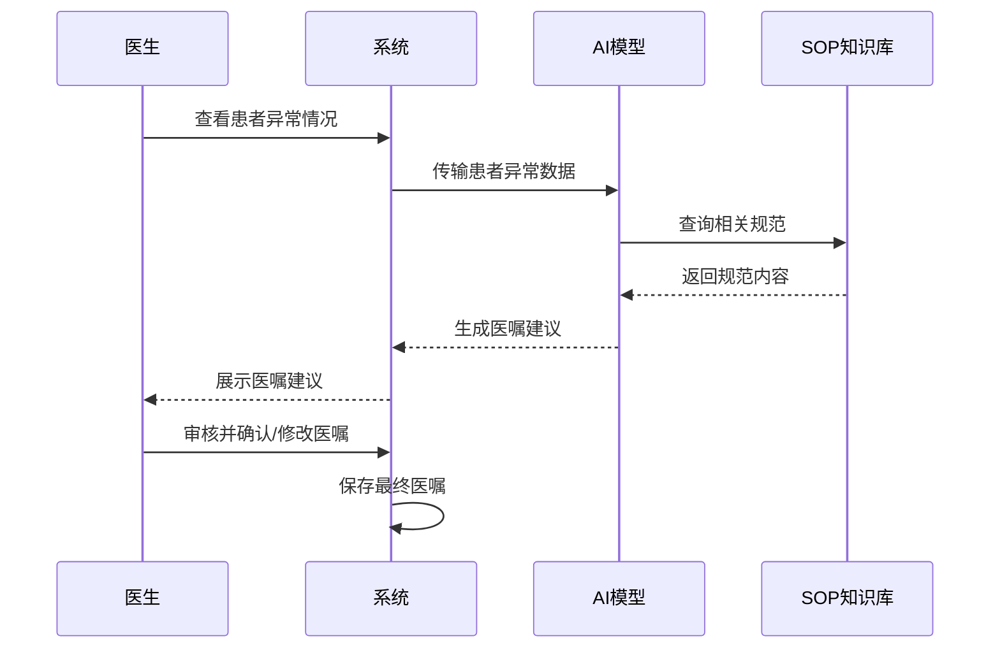
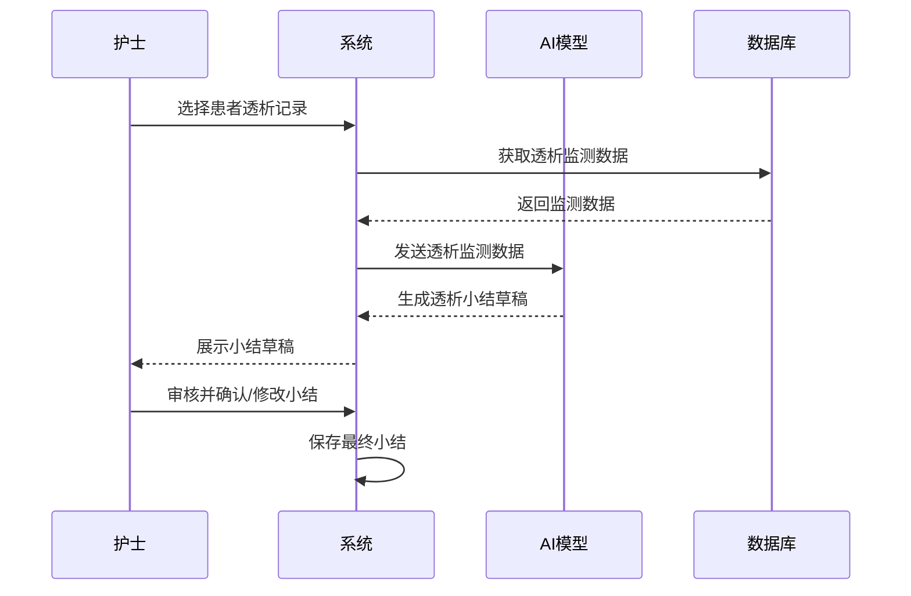
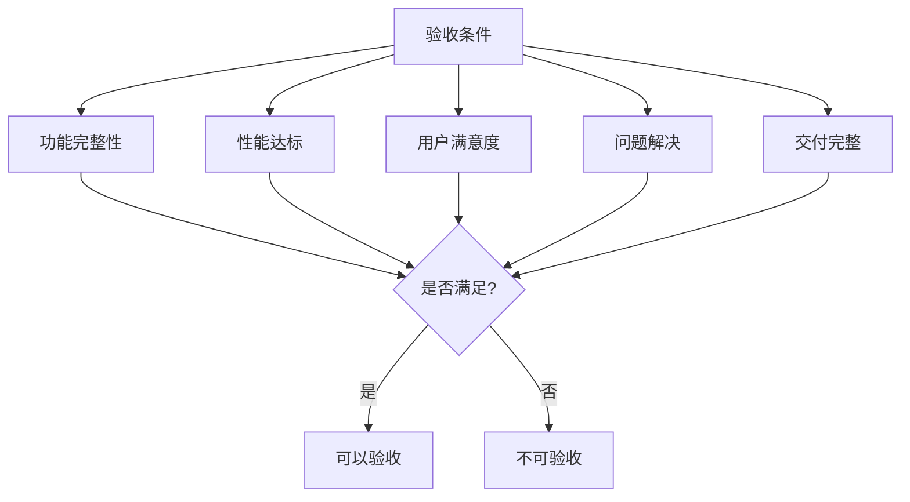

# 初始医嘱、临时医嘱和透析小结功能验收文档


## 1. 验收概述

### 1.1 验收目标

本验收旨在确认AI辅助初始医嘱生成、临时医嘱生成和透析小结生成功能是否按照需求规格说明书实现，并达到约定的质量标准。验收成功意味着系统可以安全、有效地部署到生产环境，并为医护人员提供实际价值。

### 1.2 验收范围

本次验收覆盖以下内容：
- **AI辅助医生生成初始医嘱功能**（最高优先级）
- **AI辅助医生生成临时医嘱功能**
- **AI辅助护士生成透析小结功能**
- 系统与现有医疗系统的集成
- 用户界面和交互体验
- 系统性能与稳定性

### 1.3 验收团队

验收团队由以下角色组成：
- **产品负责人**：负责确认功能是否符合业务需求
- **技术负责人**：负责评估技术实现的质量和性能
- **医生代表**：负责评估初始医嘱和临时医嘱生成功能的临床适用性
- **护士代表**：负责评估透析小结生成功能的临床适用性


### 1.4 验收流程

验收流程分为四个阶段：
1. **验收准备**：确认环境、测试数据和测试案例
2. **验收执行**：运行测试案例并记录结果
3. **问题处理**：解决发现的问题并进行回归测试
4. **正式验收**：确认所有标准都已满足，签署验收文档



## 2. 功能与需求验收

### 2.1 AI辅助医生生成初始医嘱功能（最高优先级）

#### 2.1.1 功能描述
系统通过AI技术，整合患者的透前评估结果、透析处方信息和长期医嘱数据，自动生成本次透析的初始医嘱，旨在提高医嘱生成的一致性和效率，减少医生手动录入的工作量。



#### 2.1.2 验收标准

| 类别 | 验收标准 | 验收方法 | 预期结果 |
|------|---------|---------|---------|
| 准确性 | 与长期医嘱差异识别准确率 | 比对系统识别的差异与医学专家识别的差异 | ≥75% |
| 用户体验 | 医生对推荐初始医嘱的采纳率 | 统计15位医生的实际采纳情况 | ≥75% |
| 用户体验 | 医嘱编辑修改次数占比 | 统计100次医嘱生成的编辑修改情况 | ≤25% |

### 2.2 AI辅助医生生成临时医嘱功能

#### 2.2.1 功能描述
系统通过AI技术，根据患者透析过程中的异常情况，辅助医生自动生成临时医嘱建议，提高医嘱开具的效率和规范性。



#### 2.2.2 验收标准

| 类别 | 验收标准 | 验收方法 | 预期结果 |
|------|---------|---------|---------|
| 准确性 | SOP引用正确率 | 检查所有推荐医嘱的SOP引用 | 95% |
| 用户体验 | 医生对推荐医嘱的采纳率 | 统计10位医生的实际采纳情况 | ≥75% |
| 用户体验 | 医嘱编辑修改次数占比 | 统计100次医嘱生成的编辑修改情况 | ≤25% |


### 2.3 AI辅助护士生成透析小结功能

#### 2.3.1 功能描述
系统通过AI技术，根据透析全过程的监测数据和处置记录，辅助护士自动生成规范化的透析小结，提高工作效率和记录质量。



#### 2.3.2 验收标准

| 类别 | 验收标准 | 验收方法 | 预期结果 |
|------|---------|---------|---------|
| 完整性 | 必要字段填充完整率 | 检查生成小结的必要字段填充情况 | ≥90% |
| 完整性 | 关键指标变化记录准确率 | 比对小结与原始监测数据 | ≥95% |
| 完整性 | 异常情况描述完整率 | 医学专家评估异常情况的描述完整性 | ≥95% |
| 用户体验 | 护士对生成小结的采纳率 | 统计护士的实际采纳情况 | ≥85% |
| 用户体验 | 小结内容编辑修改次数占比 | 统计小结生成的编辑修改情况 | ≤20% |


### 3.1 系统稳定性

| 性能指标 | 验收标准 | 验收方法 | 预期结果 |
|---------|---------|---------|---------|
| 系统可用性| 连续监测系统可用状态 | 自动监控系统状态 | ≥99.9% |
| 系统错误率 | 统计操作中100次的错误次数 | 自动化测试操作 | ≤1% |
| 数据处理准确率 | 验证处理后的数据与原始数据的一致性 | 数据对比测试 | ≥99.99% |


## 4. 交付物清单

### 4.1 软件组件

| 交付物名称 | 说明 | 验收标准 |
|-----------|-----|---------|
| AI辅助初始医嘱生成模块 | 根据透前评估、透析处方和长期医嘱生成初始医嘱建议的AI模块 | 功能完整，符合2.1节验收标准 |
| AI辅助临时医嘱生成模块 | 根据透析异常数据生成临时医嘱建议的AI模块 | 功能完整，符合2.2节验收标准 |
| AI辅助小结生成模块 | 根据透析监测数据生成透析小结的AI模块 | 功能完整，符合2.3节验收标准 |
| 用户界面组件 | 医生和护士操作界面，包含AI辅助功能入口 | 符合UI设计规范，响应及时 |
| 系统集成API | 与现有系统交互的接口 | 接口文档完整，调用成功率≥99.9% |
| 数据处理服务 | 处理和转换各类输入数据的服务 | 处理准确率≥99.9% |

### 4.2 文档

| 交付物名称 | 说明 | 验收标准 |
|-----------|-----|---------|
| 系统设计文档 | 详细描述系统架构和实现方案 | 内容完整，符合文档标准 |
| 用户操作手册 | 面向医生和护士的系统使用指南 | 内容清晰，覆盖所有功能点 |
| API文档 | 系统提供的API接口说明 | 接口描述准确完整 |
| 部署文档 | 系统部署和配置说明 | 按文档能成功部署系统 |
| 测试报告 | 系统测试结果和质量评估 | 测试覆盖所有功能点 |

### 4.3 数据

| 交付物名称 | 说明 | 验收标准 |
|-----------|-----|---------|
| AI模型训练数据集 | 用于训练AI模型的标准化数据集 | 数据规模符合要求，质量合格 |
| 知识库 | 结构化的SOP知识库和医嘱字典 | 覆盖常见透析异常处理规范 |
| 测试数据集 | 用于系统测试的样本数据 | 覆盖各类测试场景 |

## 5. 验收测试计划

### 5.1 测试环境

| 环境类型 | 配置要求 | 准备责任方 | 就绪标准 |
|---------|---------|-----------|---------|
| 硬件环境 | 服务器规格不低于生产环境配置 | 客户方 | 所有硬件正常运行 |
| 软件环境 | 操作系统、数据库等配置与生产环境一致 | 研发方 | 所有软件组件正常运行 |
| 测试账号 | 具备不同权限的测试账号 | 研发方 | 账号权限设置正确 |
| 测试数据 | 覆盖各类测试场景的数据集 | 双方共同 | 数据导入成功且可访问 |

### 5.2 测试用例

针对每个功能点和性能指标，详细的测试用例将包含：
- 测试目的
- 前置条件
- 测试步骤
- 预期结果
- 验收标准

完整测试用例集将作为附件提供，包含：
- 功能测试用例：20个
- 用户体验测试用例：10个

### 5.3 测试数据

| 数据类型 | 数据量 | 数据来源 | 质量标准 |
|---------|-------|---------|---------|
| 患者基本信息 | 20条 | 脱敏的历史数据 | 数据完整性≥98% |
| 透前评估数据 | 20份 | 脱敏的历史数据 | 数据完整性≥98% |
| 透析处方数据 | 20份 | 脱敏的历史数据 | 数据完整性≥98% |
| 长期医嘱数据 | 20份 | 脱敏的历史数据 | 数据完整性≥98% |
| 透析异常数据 | 覆盖10种常见异常 | 脱敏的历史数据 | 异常情况覆盖率≥95% |
| 透析监测记录 | 20份 | 脱敏的历史数据 | 数据完整性≥98% |
| 标准医嘱样本 | 30种 | 医嘱字典 | 符合临床规范 |
| 标准小结样本 | 20份 | 历史小结模板 | 符合小结规范 |

### 5.4 测试进度

| 测试阶段 | 计划天数 | 主要活动 | 完成标准 |
|---------|---------|---------|---------|
| 环境准备 | 1天 | 配置测试环境，导入测试数据 | 环境就绪，数据可用 |
| 功能测试 | 2天 | 执行功能测试用例 | 所有用例执行完毕 |
| 用户体验测试 | 2天 | 医护人员参与的实际使用测试 | 收集到充分的用户反馈 |
| 问题修复与回归 | 3天 | 解决发现的问题并回归测试 | 所有关键问题修复完毕 |
| 正式验收 | 1天 | 最终验收测试和文档确认 | 验收文档签署完成 |

```mermaid
gantt
    title 验收测试进度计划
    dateFormat D
    axisFormat %d
    
    section 测试准备
    环境           :a1, 0, 1d
    section 测试执行
    功能测试           :a2, after a1, 2d
    用户测试        :a3, after a2, 2d
    section 问题处理
    修复与回归测试      :a4, after a3, 3d
    section 验收确认
    验收确认           :a5, after a4, 1d
```



## 6. 验收测试执行

### 6.1 功能测试

功能测试将按以下流程执行：

1. **测试准备**：
   - 确认测试环境就绪
   - 准备测试数据
   - 测试人员培训

2. **测试执行**：
   - 按照测试用例逐一执行测试
   - 记录测试结果和问题
   - 每日测试进度汇报

3. **测试评估**：
   - 统计测试通过率
   - 分析发现的问题
   - 评估功能完整性


### 6.3 用户体验测试

用户体验测试将按以下流程执行：

1. **用户测试准备**：
   - 选择代表性的医生和护士参与测试
   - 准备典型的临床场景
   - 制定测试任务清单

2. **用户测试执行**：
   - 用户完成指定任务
   - 观察用户操作过程
   - 记录用户反馈和问题

3. **用户体验评估**：
   - 分析用户操作效率
   - 总结用户体验问题和建议

## 7. 问题跟踪与解决

### 7.1 问题分类标准

| 问题级别 | 定义 | 修复时限 | 验收要求 |
|---------|-----|---------|---------|
| P0(阻断) | 系统无法运行或核心功能完全无法使用 | 当日 | 100%修复 |
| P1(严重) | 核心功能严重受损但有临时解决方案 | 24小时内 | 100%修复 |
| P2(中等) | 功能可用但存在明显缺陷或不便 | 3个工作日内 | ≥95%修复 |
| P3(轻微) | 小问题或优化建议，不影响正常使用 | 下一版本计划 | ≥80%修复 |

### 7.2 解决流程

1. **问题报告**：
   - 记录问题详情(现象、复现步骤、影响)
   - 分配问题级别
   - 指定负责人

2. **问题处理**：
   - 问题分析和根本原因确定
   - 制定修复方案
   - 实施修复

3. **修复验证**：
   - 验证修复结果
   - 执行回归测试
   - 更新问题状态

### 7.3 验收标准

验收前，问题解决必须满足以下标准：
- P0和P1级问题：100%修复并验证通过
- P2级问题：≥95%修复并验证通过
- P3级问题：≥80%修复或有明确修复计划
- 所有修复通过回归测试，不引入新问题

## 8. 验收确认

### 8.1 验收条件

系统验收必须满足以下所有条件：

1. **功能完整性**：
   - 所有核心功能（初始医嘱生成、临时医嘱生成、透析小结生成）通过测试
   - 功能验收标准达标率≥95%

2. **性能达标**：
   - 所有关键性能指标达标
   - 系统稳定运行无重大问题

3. **用户满意度**：
   - 医生用户满意
   - 护士用户满意

4. **问题解决**：
   - 满足7.3节的问题解决标准
   - 无遗留关键问题

5. **交付完整**：
   - 所有约定交付物完整提交
   - 文档齐全且准确



### 8.2 签署流程

验收签署将按以下流程进行：

1. **技术验收**：
   - 技术负责人确认技术实现符合要求
   - 技术验收报告签署

2. **用户验收**：
   - 医生和护士代表确认功能满足临床需求
   - 用户验收报告签署

3. **管理验收**：
   - 项目管理方确认项目交付完整
   - 管理验收报告签署

4. **最终验收**：
   - 各方代表共同确认系统满足所有验收条件
   - 正式验收文档签署

### 8.3 确认文档

验收完成后，需由各方代表签署以下确认文档：

#### 8.3.1 验收测试报告

包含以下内容：
- 验收测试执行情况统计
- 测试案例通过率
- 发现的问题清单及解决状态
- 性能测试结果分析
- 用户体验测试结果分析


#### 8.3.2 验收确认书

| 角色 | 姓名 | 单位 | 日期 | 签名 |
|-----|-----|------|-----|-----|
| 产品负责人 |  |  |  |  |
| 技术负责人 |  |  |  |  |
| 医生代表 |  |  |  |  |
| 护士代表 |  |  |  |  |

## 附录

### 附录A：测试用例完整清单

详细测试用例将作为单独文档提供，包含：
- 功能测试用例
- 用户体验测试用例

#### 测试用例示例

##### 初始医嘱生成测试用例

```json
{
  "testCaseId": "TC-001",
  "testCaseName": "标准透析患者初始医嘱生成",
  "testCategory": "功能测试",
  "testPriority": "高",
  "preconditions": [
    "系统已正常运行",
    "已准备标准透析患者的测试数据"
  ],
  "testSteps": [
    {
      "stepNumber": 1,
      "stepDescription": "登录医生账号",
      "expectedResult": "成功登录系统"
    },
    {
      "stepNumber": 2,
      "stepDescription": "选择标准透析患者记录",
      "expectedResult": "显示患者完整信息"
    },
    {
      "stepNumber": 3,
      "stepDescription": "点击'生成初始医嘱'按钮",
      "expectedResult": "系统生成初始医嘱建议列表"
    }
  ],
  "expectedResults": {
    "functional": "生成的医嘱与患者长期医嘱一致，并根据透析处方和透前评估进行必要调整",
    "performance": "生成时间不超过2秒",
    "dataValidation": "医嘱内容完整，包含所有必要项目"
  },
  "testData": {
    "patientId": "test_std_pt_001",
    "predialysisDara": {
      "weight": "65kg",
      "bloodPressure": "130/80mmHg",
      "symptoms": "无特殊不适"
    },
    "dialysisRx": {
      "duration": "4h",
      "dialysate": "标准透析液",
      "anticoagulant": "肝素5000单位"
    },
    "longTermOrders": {
      "medications": ["降压药A", "钙剂B"],
      "dialysisParameters": "血流量250ml/min"
    }
  },
  "automationStatus": "可自动化",
  "dependencies": ["系统配置测试"]
}
```

##### 临时医嘱生成测试用例

```json
{
  "testCaseId": "TC-101",
  "testCaseName": "低血压异常情况下的医嘱推荐",
  "testCategory": "功能测试",
  "testPriority": "高",
  "preconditions": [
    "系统已正常运行",
    "已准备低血压患者的测试数据"
  ],
  "testSteps": [
    {
      "stepNumber": 1,
      "stepDescription": "登录医生账号",
      "expectedResult": "成功登录系统"
    },
    {
      "stepNumber": 2,
      "stepDescription": "选择低血压患者记录",
      "expectedResult": "显示患者完整信息"
    },
    {
      "stepNumber": 3,
      "stepDescription": "点击'AI辅助'按钮",
      "expectedResult": "系统生成临时医嘱建议列表"
    }
  ],
  "expectedResults": {
    "functional": "生成的医嘱包含处理低血压的标准处置方案",
    "performance": "生成时间不超过3秒",
    "dataValidation": "医嘱内容符合SOP规范"
  },
  "testData": {
    "patientId": "test_low_bp_001",
    "abnormalData": {
      "bloodPressure": "80/50mmHg",
      "symptoms": "头晕、乏力"
    }
  },
  "automationStatus": "可自动化",
  "dependencies": ["系统配置测试"]
}
```

### 附录B：验收测试自动化实现指南

为便于验收测试的自动化实现，本附录提供：
- 测试自动化框架建议
- 测试脚本示例
- 测试数据准备指南
- 自动化测试执行方法


### 附录C：常见问题与解决方案

针对验收过程中可能遇到的常见问题，提供标准解决方案。 

