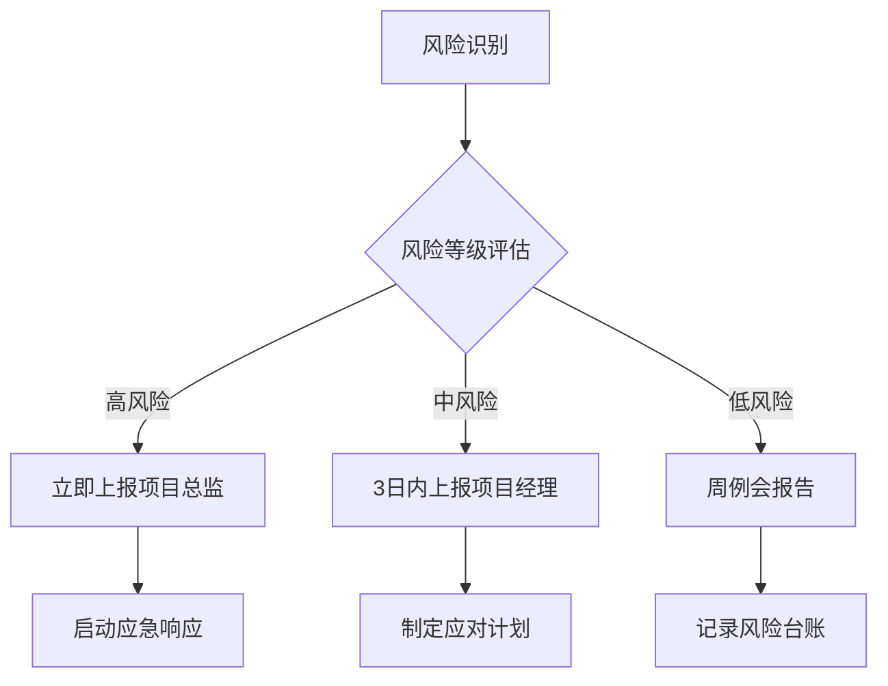

# AI辅助医嘱(初始医嘱、异常医嘱)和透析小结系统——项目计划书

## 1. 项目范围

### 1.1 AI辅助医生生成初始医嘱
- **应用场景**: 透析处方确定后,医生通过AI一键生成本次透析初始医嘱，减少重复录入，提升医嘱一致性与规范性。
- **功能简介**：系统自动整合患者透前评估、透析处方及长期医嘱信息，智能生成本次透析的初始医嘱建议。医生可一键采纳或根据患者具体情况进行个性化调整。
- **数据来源**：历史医嘱数据、长期医嘱、透前评估、透析处方参数
- **输出格式**：结构化医嘱JSON + 风险提示 + 用药依据 + AI推荐评分
- **功能边界**：
  - ✅ 支持：常规透析医嘱、药物剂量调整、时间安排、抗凝方案、补液计划
- **技术指标**：
  - 推荐准确率：75%（MVP）→90%（优化后）
- **界面展示**：

  
  图1 AI推荐初始医嘱界面1

  
  图2 AI推荐初始医嘱界面2

### 1.2 AI辅助医生生成异常医嘱
- **应用场景**: 透析过程中如患者出现低血压、肌肉痉挛等并发症，医生可点击"AI辅助生成异常医嘱"，系统结合SOP、药品库存及院区用药习惯，推荐规范化、可执行的处理方案。
- **功能简介**：透析过程中如患者出现低血压、肌肉痉挛等并发症，医生可点击"AI辅助生成异常医嘱"，系统结合SOP、药品库存及院区用药习惯，推荐规范化、可执行的处理方案。
- **数据来源**：历史处理异常经验数据、异常状态、SOP文档、药物库存状态
- **输出格式**：多异常识别 + 处理方案清单 + 用药建议 + 监测要点
- **功能边界**：
  - ✅ 支持：常见透析并发症（低血压、痉挛、恶心呕吐、胸闷等）、药物不良反应
- **技术指标**：
  - 推荐准确率：75%（MVP）→90%（优化后）
- **界面展示**：

  
图3 AI推荐异常医嘱界面

### 1.3 AI辅助护士生成透析小结
- **应用场景**: 透析结束后，护士通过AI自动生成小结，自动提取关键指标和异常处理记录，提升护理文书质量与归档效率。
- **功能简介**：透析结束后，系统自动汇总临时医嘱、护理操作记录及医嘱执行情况，生成结构化透析小结草稿。护士可直接审核、补充并归档，确保小结内容完整、规范。
- **数据来源**：透析临时医嘱、护理记录、医嘱执行记录、异常事件日志
- **输出格式**：结构化小结文档  + 异常事件摘要 + 护理评估
- **功能边界**：
  - ✅ 支持：常规透析小结、并发症记录、用药记录、护理措施总结
- **技术指标**：
  - 每周推荐合格（字段无遗漏，编辑距离相似度≥75%达标）透析小结数 / 每周总推荐透析小结数 ≥ 75% →90%（优化后）
- **界面展示**：

  
  图4 AI推荐透析小结界面

---

## 2. 项目预期成果、评价标准与验收标准

### 2.1 AI辅助护士生成透析小结
- **预期成果**: 透析小结生成平均用时缩短40%~50%，透析小结完整性≥90%。
- **评价标准与验收标准**:
    - **统计口径：**
        - 统计周期：每周
        - 统计公式：每周推荐合格（字段无遗漏，编辑距离达标）透析小结数 / 每周总推荐透析小结数 ≥ **75%**
    - **编辑距离**: (编辑距离转换为目标75%相似度为合格)
- **MVP阶段时间投入与产出**:
    | 阶段 | 时间周期 | 预期产出 | 验收标准 |
    |------|---------|----------|----------|
    | MVP开发 | 第1周 | 数据库、API及UI设计 | 准确率≥60% |
    | 数据调优 | 第3周 | 优化模型 | 准确率≥75% | 
    | 试运行 | 第4周(D28) | 生产验证 | 时间节省≥40% |

### 2.2 AI辅助医生生成初始医嘱
- **预期成果**: 初始医嘱生成平均用时缩短40%~50%，AI推荐医嘱SOP符合率≥75%。
- **评价标准与验收标准**:
    - **统计口径：**
        - 统计周期：每周
        - 统计公式：每周推荐合格医嘱数 / 每周总推荐医嘱 ≥ **75%**
    - **静默评价：**
        - 系统后台对每条AI推荐医嘱进行100分制打分，采用扣分制。

    | **维度**     | **权重** | **扣分项示例**            |
    | ------------ | ------- | ------------------------- |
    | 药物选择     | 60%     | 错误药物-30，非SOP-15    |
    | 剂量准确性   | 15%     | 超范围-15，未调体重-10   |
    | 用法/途径    | 15%     | 错误途径-10，时机不当-5  |
    | 时间合规性   | 10%     | 响应延迟-5，顺序不对-5   |
    - **合格医嘱定义：** 得分≥**75**分为合格，合格率需≥**75%**（MVP）。
- **MVP阶段时间投入与产出**:
    | 阶段 | 时间周期 | 预期产出 | 验收标准 |
    |------|---------|---------|----------|
    | 知识库构建 | 第5周 | 药品知识库、SOP规则 | 覆盖80%初始医嘱 |
    | 算法开发 | 第6周 | 医嘱生成模型 | 基础功能完成  |
    | 集成测试 | 第7-8周(D56) | 初始医嘱模块集成 |功能上线 | 
    | 运行优化 | 第9-12周(D84) | 完整功能部署生产系统 | 准确率≥75% | 


### 2.3 AI辅助医生生成异常医嘱
- **预期成果**: 异常医嘱生成平均用时缩短40%~50%，AI推荐医嘱SOP符合率≥75%。
- **评价标准与验收标准**:
    - **统计口径：**
        - 统计周期：每周
        - 统计公式：每周推荐合格（符合SOP规范）医嘱数 / 每周总推荐医嘱数 ≥ **75%** （参考《血液净化标准操作规程（2021版）》）
- **MVP阶段时间投入与产出**:
    | 阶段 | 时间周期  | 预期产出 | 验收标准 | 
    |------|---------|----------|----------|
    | 异常场景分析 | 第5周  | 异常处理规则库 | 覆盖多种异常场景 | 
    | 算法开发 | 第6周  | 实现医嘱完整功能 | 基础功能完成 | 
    | 集成测试 | 第7-8周(D56)  | 异常医嘱模块集成 | 功能上线| 
    | 运行优化 | 第9-12周(D84) | 完整功能部署生产系统 |准确率≥75% | 


### 2.4 准确率调优 (二期效能提升工程)
- **预期成果**: AI推荐准确率从75%提升至90%以上。
- **评价标准与验收标准**: 各功能点评价标准中的合格率目标提升至≥**90%**。


### 2.5 关键节点里程碑与比例
| 阶段 | 关键节点 | 达成标准 | 预计时间 |
|------|----------|----------|----------|
| **第一阶段** | 里程碑1完成 | 首模块透析小结上线 | D28±5个工作日 |
| **第二阶段** | 里程碑2完成 | 全部功能模块上线 | D56±5个工作日 |
| **第三阶段** | 里程碑3完成 | 全部准确率提升至75% | D84±5个工作日 |


---

## 3. 项目资源投入

### 3.1 第三方服务费用
#### 3.1.1 AI模型服务与API调用

| 类别 | 服务商 | 服务内容 | 用量 | 单价 | 小计(万) | 说明 |
|------|--------|---------|------|------|---------|------|
| **AI模型服务** |
| 基础语言模型 | 阿里云 | Qwen3 API调用 | 预估200万tokens | 0.06元/1K | 预估1600-8000 | 主要模型调用 |
| 医疗专用模型 | 智谱AI | ChatGLM-Med API | 预估50万tokens | 0.08元/1K | 预估500-2500 | 医疗领域优化 |
| **合计** | | | | | **预估0.2-1** | **AI模型服务总计** |
| **模型训练服务** |
| 定制化医疗推荐建模 | 阿里云 | 建模服务 | 5次 | 2.0万/次 | 10.0 | 模型定制化训练 |
| 模型微调(优化阶段) | 阿里云 | 模型精调服务 | 12次 | 1.5万/次 | 18.0 | 模型定制化训练 |
| **合计** |  |  |  |  | 28.0 | AI建模和优化性能  |


### 3.2 医护资源配合投入

#### 3.2.1 医护人员配合时间投入

| 阶段 | 医护角色 | 投入时间 | 主要工作内容 | 人员数量 | 总投入(人时) |
|------|----------|----------|-------------|----------|-------------|
| **需求调研阶段(D1-D14)** |
| 透析科主任 | 每周4小时 | 需求确认、流程梳理 | 1人 | 8 |
| 主管护师 | 每周6小时 | 护理流程设计、小结模板 | 2人 | 24 |
| 主治医师 | 每周4小时 | 医嘱规范制定、异常处理SOP | 3人 | 24 |
| **开发测试阶段(D15-D84)** |
| 透析科主任 | 每周2小时 | 进度跟踪、关键决策 | 1人 | 20 |
| 主管护师 | 每周4小时 | 功能测试、流程验证 | 2人 | 80 |
| 主治医师 | 每周3小时 | 医嘱准确性验证、案例提供 | 3人 | 90 |
| 护士 | 每周2小时 | 界面测试、使用反馈 | 5人 | 100 |
| **试运行阶段(D71-D84)** |
| 全体医护人员 | 每周8小时 | 实际使用、问题反馈、数据收集 | 15人 | 168 |
| **合计** | | | | | **514人时** |

#### 3.2.2 医护资源配合成本

| 资源类型 | 单价(元/小时) | 总时间(小时) | 小计(万元) | 说明 |
|----------|-------------|-------------|-----------|------|
| 透析科主任 | 200 | 28 | 0.56 | 高级专家指导 |
| 主治医师 | 150 | 114 | 1.71 | 医嘱规范制定 |
| 主管护师 | 100 | 104 | 1.04 | 护理流程设计 |
| 护士 | 80 | 268 | 2.14 | 功能测试反馈 |
| **合计** | | **514** | **5.45** | **医护配合总成本** |

#### 3.2.3 物质资源投入

| 资源类型 | 数量 | 单价(万元) | 小计(万元) | 用途说明 |
|----------|------|-----------|-----------|----------|
| **硬件设备** |
| 服务器(高性能) | 2台 | 8.0 | 16.0 | AI模型部署、数据处理 |
| 数据库服务器 | 1台 | 12.0 | 12.0 | 数据存储、备份 |
| 网络安全设备 | 1套 | 5.0 | 5.0 | 防火墙、入侵检测 |
| 开发工作站 | 5台 | 1.2 | 6.0 | 开发团队使用 |
| **软件许可** |
| 数据库许可证 | 1套 | 8.0 | 8.0 | Oracle/SQL Server |
| 开发工具许可 | 1套 | 3.0 | 3.0 | IDE、版本控制 |
| 安全软件许可 | 1套 | 2.0 | 2.0 | 杀毒、加密软件 |
| **基础设施** |
| 机房租赁 | 24个月 | 0.5 | 12.0 | 服务器托管 |
| 网络带宽 | 24个月 | 0.3 | 7.2 | 专线接入 |
| 备份存储 | 1套 | 4.0 | 4.0 | 数据备份方案 |
| **合计** | | | **75.2** | **物质资源总投入** |

### 3.3 综合资源投入汇总

| 资源类别 | 投入金额(万元) | 占比 | 说明 |
|----------|-------------|------|------|
| AI模型服务费用 | 28.2 | 25.8% | API调用+模型训练 |
| 医护资源配合 | 5.45 | 5.0% | 人员时间成本 |
| 物质资源投入 | 75.2 | 68.7% | 硬件+软件+基础设施 |
| 风险管理预算 | 0.5 | 0.5% | 应急响应基金 |
| **总计** | **109.35** | **100%** | **项目资源总投入** |

### 3.4 效益提升预期

#### 3.4.1 效率提升指标
- **医生工作效率提升40%**：每日医嘱生成时间从平均30分钟缩短至18分钟
- **护士文书工作减少50%**：透析小结编写时间从平均45分钟缩短至22分钟  
- **医疗差错减少30%**：通过AI辅助和标准化流程，降低人为错误

#### 3.4.2 经济效益分析
| 效益类型 | 年节省成本(万元) | 计算依据 |
|----------|----------------|----------|
| 医生时间节省 | 156 | 10名医生×12分钟/日×250工作日×200元/小时 |
| 护士时间节省 | 287.5 | 25名护士×23分钟/日×250工作日×120元/小时 |
| 差错减少收益 | 50 | 预估减少医疗纠纷和重复检查成本 |
| **年度总收益** | **493.5** | **投资回收期约2.7个月** |

**结论**：建议分阶段投入，在确保技术可行性的前提下推进实施。

---

## 4. 项目里程碑

### 4.1 完整项目时间线（D1-D168，24周）

#### 第一阶段：MVP开发与上线（第1-12周，D1-D84）

#### 第1周：系统设计与原型
| 日期 | 任务 | 交付物 | 验收标准 | 依赖关系 |
|------|------|--------|----------|----------|
| D1-D2 | 数据库设计 | ER图、数据字典 | 支持3个功能模块数据需求 | 项目启动 |
| D3-D4 | API接口设计 | API文档v1.0 | 定义20+核心接口 | 依赖D1-D2 |
| D5-D7 | UI原型设计 | 高保真原型 | 3个功能模块完整交互流程 | 依赖D3-D4 |

#### 第2-3周：透析小结模块开发启动
| 日期 | 任务 | 交付物 | 验收标准 | 依赖关系 |
|------|------|--------|----------|----------|
| D8-D9 | 基础框架搭建 | 项目脚手架、CI/CD | 代码仓库可编译部署 | 依赖D5-D7 |
| D10-D12 | 数据采集模块 | 数据接口v1.0 | 能够读取HIS系统数据 | 依赖D8-D9 |
| D13-D15 | AI模型集成准备 | 模型部署环境 | 可调用基础NLP服务 | 依赖D10-D12 |
| D16-D21 | 透析小结模块测试完成 | 透析小结原型v1.0 | 生成准确率达到60% | 依赖D13-D15 |

#### 第4周：透析小结功能完善
| 日期 | 任务 | 交付物 | 验收标准 | 依赖关系 |
|------|------|--------|----------|----------|
| D22-D24 | 小结生成算法优化 | 优化后的生成模型 | 准确率达到75%以上 | 依赖D16-D21 |
| D25-D26 | 前端界面开发 | 完整用户界面 | 支持审核、编辑、保存 | 依赖D22-D24 |
| D27-D28 | 透析小结上线(**里程碑1检查**) | 测试数据集100条 | 覆盖常见透析小结场景 | 依赖D25-D26 |

#### 第5-8周：初始医嘱模块和异常医嘱模块
| 日期 | 任务 | 交付物 | 验收标准 | 依赖关系 |
|------|------|--------|----------|----------|
| D29-D31 | 药品知识库构建 | 药品数据库v1.0 | 收录透析常用药品300+ | 依赖D27-D28 |
| D32-D35 | 初始医嘱算法开发 | 医嘱生成模型v1.0 | 基础规则引擎+AI推荐 | 依赖D29-D31 |
| D36-D38 | 精细化异常情况识别模块 | 精细化异常分类 | 识别10+常见透析并发症 | 依赖D32-D35 |
| D39-D40 | 医嘱界面开发 | 医嘱管理界面 | 支持生成、编辑、确认 | 依赖D36-D38 |
| D41-D45 | 初始和异常医嘱场景规则建设 | 异常医嘱逻辑资源库v1.0 | 覆盖透析异常场景50+ | 依赖D39-D40 |
| D46-D49 | 初始和异常医嘱算法开发 | 异常医嘱推荐引擎v1.0 | 根据症状特征推荐处理方案 | 依赖D41-D45 |
| D50-D52 | 异常医嘱模块界面开发 | 初始和异常医嘱模块界面 | 支持异常识别、方案推荐 | 依赖D46-D49 |
| D53-D56 | 3个功能模块上线(**里程碑2检查**) | 集成测试报告 | 3个模块基本功能正常,正确大于等于60% | 依赖D50-D52 |

#### 第9-10周：系统集成与测试
| 日期 | 任务 | 交付物 | 验收标准 | 依赖关系 |
|------|------|--------|----------|----------|
| D57-D59 | 模块集成测试 | 集成测试报告 | 3个模块协同工作正常 | 依赖D53-D56 |
| D60-D70 | 模型准确性提升 | 完整系统β版本 | 准确率提升 | 依赖D57-D59 |

#### 第11-12周：预生产验证
| 日期 | 任务 | 交付物 | 验收标准 | 依赖关系 |
|------|------|--------|----------|----------|
| D71-D75 | 试运行启动 | 试运行报告 | 处理真实案例100+,提升准确率 | 依赖D60-D70 |
| D76-D80 | 问题修复与优化 | Bug修复 | 解决试运行发现的问题,提升准确率 | 依赖D71-D75 |
| D81-D83 | 生产环境部署 | 部署文档 | 系统稳定运行3天,提升准确率 | 依赖D76-D80 |
| D84 | MVP验收(**里程碑3检查**) | MVP项目交付文档 | 3个功能模块≥75%准确率 | 依赖D81-D83 |

### 4.2 第二阶段：深度优化与准确率提升（第13-24周，D85-D168）

#### 第13-16周：数据挖掘与模型优化
| 日期 | 任务 | 交付物 | 验收标准 | 依赖关系 |
|------|------|--------|----------|----------|
| D85-D91 | 用户行为数据分析 | 用户修改模式报告 | 识别TOP20修改场景 | 依赖D84 |
| D92-D98 | 模型深度调优 | 优化后的AI模型v2.0 | 准确率提升至80% | 依赖D85-D91 |
| D99-D105 | 个性化推荐算法 | 个性化推荐引擎 | 支持医生偏好学习 | 依赖D92-D98 |
| D106-D112 | 第一轮优化上线(**里程碑4检查**) | 优化版本部署 | 准确率≥80% | 依赖D99-D105 |

#### 第17-20周：多院区适配与扩展
| 日期 | 任务 | 交付物 | 验收标准 | 依赖关系 |
|------|------|--------|----------|----------|
| D113-D119 | 多院区用药规范适配 | 院区配置管理系统 | 支持5+院区差异化配置 | 依赖D106-D112 |
| D120-D126 | 知识库扩展与更新 | 扩展知识库v2.0 | 药品库增至500+，场景覆盖率90% | 依赖D113-D119 |
| D127-D133 | 异常场景深度学习 | 高级异常识别模型 | 识别30+异常场景，准确率85% | 依赖D120-D126 |
| D134-D140 | 第二轮优化上线(**里程碑5检查**) | 全功能优化版本 | 准确率≥85% | 依赖D127-D133 |

#### 第21-24周：高级功能与系统完善
| 日期 | 任务 | 交付物 | 验收标准 | 依赖关系 |
|------|------|--------|----------|----------|
| D141-D147 | 预测性风险预警 | 风险预警系统 | 提前识别高危患者，预警准确率70% | 依赖D134-D140 |
| D148-D154 | 质量控制与审计系统 | 质控审计模块 | 自动质控检查，合规率95% | 依赖D141-D147 |
| D155-D161 | 系统性能优化 | 高性能系统v3.0 | 支持100+并发，响应时间<2秒 | 依赖D148-D154 |
| D162-D168 | 最终验收(**里程碑6检查**) | 完整项目交付 | 准确率≥90%，系统稳定运行 | 依赖D155-D161 |

### 4.3 项目甘特图与依赖关系

```mermaid
gantt
    title AI辅助医嘱与透析小结系统项目甘特图
    dateFormat X
    axisFormat %d

    section 第一阶段(MVP)
    系统设计与原型        :a1, 1, 7d
    透析小结模块开发       :a2, after a1, 14d
    透析小结功能完善       :a3, after a2, 7d
    医嘱模块开发          :a4, after a3, 28d
    系统集成与测试        :a5, after a4, 14d
    预生产验证           :a6, after a5, 14d

    section 第二阶段(优化)
    数据挖掘与模型优化     :b1, after a6, 28d
    多院区适配与扩展       :b2, after b1, 28d
    高级功能与系统完善     :b3, after b2, 28d

    section 关键里程碑
    里程碑1-透析小结上线   :milestone, m1, 28, 0d
    里程碑2-全功能上线     :milestone, m2, 56, 0d
    里程碑3-MVP验收       :milestone, m3, 84, 0d
    里程碑4-第一轮优化     :milestone, m4, 112, 0d
    里程碑5-第二轮优化     :milestone, m5, 140, 0d
    里程碑6-最终验收       :milestone, m6, 168, 0d
```



### 4.4 关键控制点与风险预警

#### 每周必检项目
- **进度风险**：每周三进度同步会，红色预警需升级处理
- **质量风险**：每周五代码Review，测试覆盖率≥80%
- **资源风险**：每周一资源评估，提前2周预警资源不足

#### 关键依赖路径
1. **关键路径1**：D1→D7→D21→D28 (透析小结模块)
2. **关键路径2**：D29→D56 (医嘱模块)
3. **关键路径3**：D57→D84 (系统集成与MVP验收)

---

## 5. 项目风险点与应对方案

### 5.1 量化风险矩阵

| 风险ID | 风险类别 | 风险描述 | 概率 | 影响度 | 风险等级 | 影响金额(万) | 应对策略 |
|--------|----------|----------|------|--------|----------|-------------|----------|
| R01 | 技术风险 | AI模型准确率无法达到75% | 30% | 高 | 🔴高 | 50-100 | 规避+减轻 |
| R02 | 技术风险 | HIS系统集成困难 | 40% | 高 | 🔴高 | 30-80 | 减轻+转移 |
| R03 | 技术风险 | 系统性能无法满足并发要求 | 25% | 中 | 🟡中 | 20-50 | 减轻 |
| R04 | 业务风险 | 医护人员接受度低 | 35% | 高 | 🔴高 | 全项目 | 规避+接受 |
| R05 | 业务风险 | AI推荐错误导致医疗事故 | 10% | 极高 | 🔴高 | 500+ | 规避+转移 |
| R06 | 资源风险 | 核心开发人员离职 | 20% | 中 | 🟡中 | 10-30 | 减轻+接受 |
| R07 | 资源风险 | 预算超支 | 25% | 中 | 🟡中 | 50-200 | 减轻+接受 |
| R08 | 法规风险 | 医疗数据合规问题 | 15% | 高 | 🟡中 | 20-100 | 规避+转移 |
| R09 | 市场风险 | 竞争对手产品抢先上市 | 30% | 中 | 🟡中 | 项目价值下降 | 接受+减轻 |
| R10 | 外部风险 | 第三方AI服务中断 | 20% | 中 | 🟡中 | 5-20 | 减轻+转移 |

### 5.2 风险等级定义

| 概率等级 | 百分比范围 | 影响度等级 | 项目影响 | 风险等级矩阵 |
|----------|------------|------------|----------|-------------|
| 很低 | 0-5% | 很低 | <5%影响 | 🟢低 |
| 低 | 6-15% | 低 | 5-15%影响 | 🟡中 |
| 中 | 16-35% | 中 | 16-35%影响 | 🟠高 |
| 高 | 36-65% | 高 | 36-65%影响 | 🔴极高 |
| 很高 | 66-100% | 极高 | >65%影响 | ⚫致命 |

### 5.3 详细风险应对方案

#### R01 - AI模型准确率风险 🔴高风险
```markdown
**触发条件**：第4周测试准确率<60%
**预警机制**：每周准确率测试，连续2周低于预期启动应急方案
**应对措施**：
- 规避：提前准备3套技术方案，并行开发
- 减轻：增加训练数据量，聘请医疗AI专家
- 应急方案：启动规则引擎+AI混合方案
**责任人**：AI算法负责人
**预算准备**：50万应急资金
**时间影响**：可能延期4-8周
```

#### R02 - HIS系统集成风险 🔴高风险
```markdown
**触发条件**：第2周接口调研发现重大技术障碍
**预警机制**：D10前必须完成接口测试
**应对措施**：
- 减轻：第1周即与医院IT部门深度对接
- 转移：聘请HIS系统厂商技术支持
- 应急方案：采用数据导出+定时同步方案
**责任人**：系统集成负责人
**预算准备**：30万技术服务费
**时间影响**：可能延期2-4周
```

#### R05 - 医疗安全风险 🔴高风险
```markdown
**触发条件**：AI推荐出现明显医疗错误
**预警机制**：所有推荐均需医生确认，建立审计日志
**应对措施**：
- 规避：建立多重安全检查机制
- 转移：购买医疗责任保险，明确责任界限
- 接受：制定医疗事故应急处理流程
**责任人**：项目总监+医疗安全官
**预算准备**：专项保险费用
```

### 5.4 风险监控与报告机制

#### 风险监控频率
- **高风险(🔴)**：每日监控，周报告
- **中风险(🟡)**：每周监控，双周报告  
- **低风险(🟢)**：每月监控，月报告

#### 风险上报流程


### 5.5 风险预算分配

| 风险类别 | 预算分配(万) | 占总预算比例 | 用途 |
|----------|-------------|-------------|------|
| 技术风险应对 | 120 | 3.5% | 备选方案开发、专家咨询 |
| 人员风险应对 | 50 | 1.5% | 人员替换、知识转移 |
| 合规风险应对 | 80 | 2.3% | 法律咨询、合规审计 |
| 应急响应基金 | 100 | 2.9% | 突发事件处理 |
| **风险管理总计** | **350** | **10.2%** | **总项目预算的10%** |

---

## 6. 持续改进准确率路线图

| **阶段**     | **主要目标**         | **改进重点**                   | **预期合格率** |
| ------------ | ------------------- | ------------------------------ | ------------ |
| 初始阶段     | 建立基础模型和知识库 | 收集基础数据，构建核心问答对   |  60%     |
| 静默学习期   | 积累医护修改数据     | 分析修改模式，识别系统薄弱环节 |    >70%           |
| 首次微调模型 | 提高基础准确率       | 针对高频修改点进行模型调整     |≥75%  (MVP验收)      |
| 第二阶段持续优化     | 提升准确率   | 异常情况学习+不同院区和医生用药偏好     | >90%         |
| 高级阶段     | 预测医疗需求变化     | 根据历史数据主动预警高危风险   | >90%         |

> 随着数据积累和模型优化，系统目标是将AI推荐医嘱的合格率从MVP阶段的**75%**逐步提升至**90%**以上。


