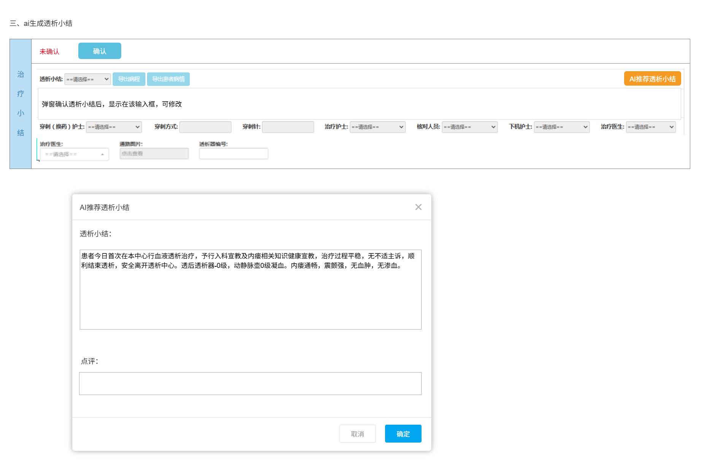

# AI辅助医嘱(初始医嘱、异常医嘱)和透析小结系统——项目计划书

## 1. 项目范围

### 1.1 技术架构说明
- **实施方案**: 采用浏览器插件架构，实现零侵入式集成
- **核心原则**: 不修改现有HIS系统任何代码，通过Chrome浏览器插件实现功能扩展
- **技术特点**: 
  - ✅ 零系统风险：不影响现有医疗系统稳定性
  - ✅ 快速部署：无需系统停机或代码变更
  - ✅ 兼容性强：支持Chrome及主流Chromium内核浏览器
  - ✅ 数据安全：通过安全API接口读取必要数据，不存储敏感信息

### 1.2 AI辅助医生生成初始医嘱
- **应用场景**: 透析处方确定后,医生通过浏览器插件一键生成本次透析初始医嘱，减少重复录入，提升医嘱一致性与规范性。
- **功能简介**：插件自动识别当前页面患者信息，整合透前评估、透析处方及长期医嘱信息，智能生成本次透析的初始医嘱建议。医生可一键采纳或根据患者具体情况进行个性化调整。
- **技术实现**：通过浏览器插件读取页面数据，调用后台AI模型API，在页面侧边栏展示推荐结果
- **数据来源**：历史医嘱数据、长期医嘱、透前评估、透析处方参数
- **输出格式**：结构化医嘱JSON + 风险提示 + 用药依据（标注SOP/知识库来源）+ AI推荐评分
- **功能边界**：
  - ✅ 支持：常规透析医嘱、药物剂量调整、时间安排、抗凝方案、补液计划
- **技术指标**：
  - 推荐准确率：60%（MVP）→75%（第二阶段）
- **界面展示**：

  
  图1 AI推荐初始医嘱界面1

  
  图2 AI推荐初始医嘱界面2

### 1.3 AI辅助医生生成异常医嘱
- **应用场景**: 透析过程中如患者出现低血压、肌肉痉挛等并发症，医生可点击插件"AI辅助生成异常医嘱"，系统结合SOP、药品库存及院区用药习惯，推荐规范化、可执行的处理方案。
- **功能简介**：透析过程中如患者出现并发症，医生通过插件快速获取AI推荐的异常医嘱，系统结合SOP、药品库存及院区用药习惯，推荐规范化、可执行的处理方案。
- **技术实现**：插件监测页面异常状态变化，自动触发或手动调用异常医嘱推荐功能
- **数据来源**：历史处理异常经验数据、异常状态、SOP文档、药物库存状态
- **输出格式**：多异常识别 + 处理方案清单 + 用药建议（标注SOP/知识库来源）+ 监测要点
- **功能边界**：
  - ✅ 支持：常见透析并发症（低血压、痉挛、恶心呕吐、胸闷等）、药物不良反应
- **技术指标**：
  - 推荐准确率：60%（MVP）→75%（第二阶段）
- **界面展示**：

  
图3 AI推荐异常医嘱界面

### 1.4 AI辅助护士生成透析小结
- **应用场景**: 透析结束后，护士通过插件AI自动生成小结，自动提取关键指标和异常处理记录，提升护理文书质量与归档效率。
- **功能简介**：透析结束后，插件自动汇总临时医嘱、护理操作记录及医嘱执行情况，生成结构化透析小结草稿。护士可直接审核、补充并归档，确保小结内容完整、规范。
- **技术实现**：插件自动采集页面中的护理记录数据，调用AI模型生成小结，支持在线编辑和保存
- **数据来源**：透析临时医嘱、护理记录、医嘱执行记录、异常事件日志
- **输出格式**：结构化小结文档 + 异常事件摘要 + 护理评估（标注数据来源）
- **功能边界**：
  - ✅ 支持：常规透析小结、并发症记录、用药记录、护理措施总结
- **技术指标**：
  - 每周推荐合格（字段无遗漏，编辑距离相似度≥75%达标）透析小结数 / 每周总推荐透析小结数 ≥ 60%（MVP）→75%（第二阶段）
- **界面展示**：

  
  图4 AI推荐透析小结界面


---

## 2. 项目预期成果、评价标准与验收标准

### 2.1 主合同范围界定
**本项目主合同包含第一阶段和第二阶段，共计12周（D1-D84）：**
- **第一阶段（8周，D1-D56）**：MVP功能开发与上线
- **第二阶段（4周，D57-D84）**：准确率提升至75%

**第三阶段（高级功能）将作为独立合同执行，包括但不限于：**
- 预测性风险预警系统
- 质量控制与审计系统  
- 高级数据分析与报表
- 多院区个性化配置扩展

### 2.2 AI辅助护士生成透析小结
- **预期成果**: 透析小结生成平均用时缩短40%~50%，透析小结完整性≥90%。
- **评价标准与验收标准**:
    - **统计口径：**
        - 统计周期：每周
        - 统计公式：每周推荐合格（字段无遗漏，编辑距离达标）透析小结数 / 每周总推荐透析小结数 ≥ **60%**（第一阶段）→**75%**（第二阶段）
    - **编辑距离**: (编辑距离转换为目标75%相似度为合格)
- **阶段时间投入与产出**:
    | 阶段 | 时间周期 | 预期产出 | 验收标准 |
    |------|---------|----------|----------|
    | 第一阶段MVP | 第1-8周 | 插件基础功能、AI模型集成 | 准确率≥60% |
    | 第二阶段优化 | 第9-12周 | 模型优化、准确率提升 | 准确率≥75% |

### 2.3 AI辅助医生生成初始医嘱
- **预期成果**: 初始医嘱生成平均用时缩短40%~50%，AI推荐医嘱SOP符合率≥75%。
- **评价标准与验收标准**:
    - **统计口径：**
        - 统计周期：每周
        - 统计公式：每周推荐合格医嘱数 / 每周总推荐医嘱 ≥ **60%**（第一阶段）→**75%**（第二阶段）
    - **静默评价：**
        - 系统后台对每条AI推荐医嘱进行100分制打分，采用扣分制。

    | **维度**     | **权重** | **扣分项示例**            |
    | ------------ | ------- | ------------------------- |
    | 药物选择     | 60%     | 错误药物-30，非SOP-15    |
    | 剂量准确性   | 15%     | 超范围-15，未调体重-10   |
    | 用法/途径    | 15%     | 错误途径-10，时机不当-5  |
    | 时间合规性   | 10%     | 响应延迟-5，顺序不对-5   |
    - **合格医嘱定义：** 得分≥**60**分为合格（第一阶段），≥**75**分为合格（第二阶段）
- **阶段时间投入与产出**:
    | 阶段 | 时间周期 | 预期产出 | 验收标准 |
    |------|---------|---------|----------|
    | 第一阶段MVP | 第1-8周 | 插件开发、知识库构建、基础AI模型 | 准确率≥60% |
    | 第二阶段优化 | 第9-12周 | 模型深度优化、多场景适配 | 准确率≥75% |

### 2.4 AI辅助医生生成异常医嘱
- **预期成果**: 异常医嘱生成平均用时缩短40%~50%，AI推荐医嘱SOP符合率≥75%。
- **评价标准与验收标准**:
    - **统计口径：**
        - 统计周期：每周
        - 统计公式：每周推荐合格（符合SOP规范）医嘱数 / 每周总推荐医嘱数 ≥ **60%**（第一阶段）→**75%**（第二阶段）（参考《血液净化标准操作规程（2021版）》）
    
    - **SOP符合度评判标准（100分制）：**
        
        | **评判维度** | **权重** | **评分标准** | **扣分项示例** |
        |-------------|---------|-------------|---------------|
        | **异常识别准确性** | 30% | 正确识别透析并发症类型和严重程度 | 误判并发症类型-15分，漏判严重程度-10分 |
        | **处理方案规范性** | 40% | 处理步骤符合SOP标准流程 | 违反SOP流程-20分，步骤顺序错误-10分 |
        | **药物选择合规性** | 20% | 药物选择符合适应症和禁忌症要求 | 禁忌药物-15分，适应症不符-10分 |
        | **剂量计算准确性** | 10% | 剂量计算符合体重、肾功能等调整要求 | 剂量超范围-8分，未按体重调整-5分 |
        
        **合格标准定义：**
        - 第一阶段：总分≥60分为SOP符合
        - 第二阶段：总分≥75分为SOP符合
        

- **阶段时间投入与产出**:
    | 阶段 | 时间周期  | 预期产出 | 验收标准 | 
    |------|---------|----------|----------|
    | 第一阶段MVP | 第1-8周  | 异常识别模块、处理规则库 | SOP符合度≥60% | 
    | 第二阶段优化 | 第9-12周  | 深度学习模型、场景扩展 | SOP符合度≥75% |

### 2.5 关键节点里程碑
| 阶段 | 关键节点 | 达成标准 | 预计时间 | 合同范围 |
|------|----------|----------|----------|----------|
| **第一阶段** | 里程碑1完成 | 插件基础功能上线，准确率≥60% | D56±5个工作日 | 主合同 |
| **第二阶段** | 里程碑2完成 | 全部功能优化，准确率≥75% | D84±5个工作日 | 主合同 |
| **第三阶段** | 里程碑3完成 | 高级功能上线，准确率≥90% | 独立合同 | 扩展合同 |

---

## 3. 项目资源投入

### 3.1 总体IT成本估算（主合同范围）

| 成本类别       | 项目说明                | 单价       | 数量  | 总价(万元) | 备注                     |
|----------------|-------------------------|------------|-------|------------|---------------------------|
| **基础云服务** |                         |            |       |            |                          |
| 云服务器(ECS)  | 4核8G通用型             | 0.6万/年   | 6台   | 3.6        | 插件架构降低服务器需求   |
| 对象存储(OSS)  | 5TB标准存储             | 0.6万/年   | 1     | 0.6        | 知识库和模型存储         |
| **AI服务**     |                         |            |       |            |                          |
| 基础语言模型调用 | Qwen3 API              | 0.15元/1K tokens | 200万tokens | 3.0    | 主要模型调用，医疗级精度要求         |
| 医疗专用模型调用 | ChatGLM-Med API        | 0.25元/1K tokens | 120万tokens | 3.0     | 医疗领域专业优化，高精度推理                          |
| **模型训练服务** |                         |            |       |            |                          |
| 定制化医疗推荐建模 | 阿里云                | 2万/次   | 5次   | 10.0        | 模型定制化训练           |
| 模型微调(优化阶段) | 阿里云                | 1.5万/次   | 6次   | 9.0        | 第二阶段模型优化         |
| **主合同范围合计** |                 |   |   | **29.2**       | 第一、二阶段总成本            |

### 3.2 甲方配合资源要求

#### 3.2.1 IT技术资源配合
- **系统权限开放**：提供HIS系统数据读取权限，包括患者信息、医嘱记录、护理文档等
- **网络环境配置**：确保插件能够正常访问后台API服务，配置必要的网络白名单
- **测试环境支持**：提供与生产环境一致的测试环境，支持插件功能验证
- **技术对接人员**：指定专职IT技术人员，负责权限配置、环境搭建等技术配合工作

#### 3.2.2 医护资源配合
- **需求调研配合**：透析科主任、主治医师、主管护师参与需求确认和流程梳理
- **功能测试配合**：安排医护人员参与功能测试，提供真实场景下的使用反馈
- **培训配合**：组织医护人员参加系统使用培训，确保功能正确使用
- **试运行配合**：在试运行期间提供必要的医护人员支持，收集使用数据和改进建议

### 3.3 效益提升预期

- 医生工作效率提升：初始医嘱和异常医嘱生成时间缩短40%-50%
- 护士文书工作减少：透析小结编写时间缩短40%-50%
- 医疗差错减少：通过AI辅助和标准化流程，降低人为错误
- 系统风险降低：零侵入式部署，不影响现有系统稳定性

---

## 4. 项目里程碑（主合同范围：D1-D84）

### 4.1 第一阶段：MVP开发与上线（第1-8周，D1-D56）

#### 第1-2周：插件架构设计与开发环境搭建
| 日期 | 任务 | 交付物 | 验收标准 | 依赖关系 |
|------|------|--------|----------|----------|
| D1-D3 | 插件架构设计 | 技术架构文档、插件框架 | 支持Chrome浏览器，具备基础数据读取能力 | 项目启动 |
| D4-D7 | 后台API设计 | API文档v1.0、接口规范 | 定义15+核心接口，支持数据读取和AI调用 | 依赖D1-D3 |
| D8-D10 | 开发环境搭建 | 开发环境、CI/CD流程 | 插件可编译打包，API服务可部署 | 依赖D4-D7 |
| D11-D14 | 数据权限对接 | 数据接口v1.0 | 能够安全读取HIS系统必要数据 | 依赖D8-D10，需甲方配合 |

#### 第3-4周：透析小结模块开发
| 日期 | 任务 | 交付物 | 验收标准 | 依赖关系 |
|------|------|--------|----------|----------|
| D15-D18 | 小结数据采集模块 | 数据采集插件组件 | 能够识别并提取透析相关数据 | 依赖D11-D14 |
| D19-D22 | AI模型集成 | 小结生成AI服务 | 基础文本生成能力，准确率≥50% | 依赖D15-D18 |
| D23-D26 | 插件UI开发 | 小结生成界面 | 支持数据展示、编辑、保存 | 依赖D19-D22 |
| D27-D28 | 小结模块测试 | 测试报告、功能演示 | 基础功能正常，准确率≥60% | 依赖D23-D26 |

#### 第5-6周：医嘱模块开发
| 日期 | 任务 | 交付物 | 验收标准 | 依赖关系 |
|------|------|--------|----------|----------|
| D29-D32 | 药品知识库构建 | 药品数据库v1.0、SOP规则库 | 收录透析常用药品200+，SOP规则50+ | 依赖D27-D28，需甲方提供SOP文档 |
| D33-D36 | 初始医嘱AI模型 | 医嘱生成模型v1.0 | 基础规则引擎+AI推荐，准确率≥50% | 依赖D29-D32 |
| D37-D40 | 异常医嘱AI模型 | 异常医嘱推荐引擎v1.0 | 识别10+常见并发症，推荐处理方案 | 依赖D33-D36 |
| D41-D42 | 医嘱插件UI开发 | 医嘱生成界面 | 支持初始和异常医嘱生成、编辑 | 依赖D37-D40 |

#### 第7-8周：系统集成与上线
| 日期 | 任务 | 交付物 | 验收标准 | 依赖关系 |
|------|------|--------|----------|----------|
| D43-D46 | 插件功能集成 | 完整插件v1.0 | 3个功能模块协同工作正常 | 依赖D41-D42 |
| D47-D50 | 系统测试与优化 | 测试报告、性能优化 | 功能稳定，响应时间<3秒 | 依赖D43-D46 |
| D51-D54 | 生产环境部署 | 部署文档、运维手册 | 插件可正常安装使用 | 依赖D47-D50 |
| D55-D56 | 第一阶段验收(**里程碑1**) | MVP交付文档 | 3个功能模块准确率≥60% | 依赖D51-D54 |

### 4.2 第二阶段：准确率提升与功能优化（第9-12周，D57-D84）

#### 第9周：数据收集与分析（D57-D63）
| 日期 | 任务 | 交付物 | 验收标准 | 依赖关系 |
|------|------|--------|----------|----------|
| D57-D59 | 用户行为数据收集 | 用户修改模式分析报告 | 收集50+真实使用案例 | 依赖D55-D56，需甲方配合试用 |
| D60-D63 | 数据分析与问题识别 | 准确率问题分析报告 | 识别主要准确率瓶颈 | 依赖D57-D59 |

#### 第10周：AI模型深度优化（D64-D70）
| 日期 | 任务 | 交付物 | 验收标准 | 依赖关系 |
|------|------|--------|----------|----------|
| D64-D67 | AI模型算法优化 | 优化后的AI模型v2.0 | 准确率提升至68% | 依赖D60-D63 |
| D68-D70 | 知识库扩展完善 | 扩展知识库v2.0 | 药品库增至300+，SOP规则80+ | 依赖D64-D67，需甲方提供更多SOP |

#### 第11周：多场景适配与个性化（D71-D77）
| 日期 | 任务 | 交付物 | 验收标准 | 依赖关系 |
|------|------|--------|----------|----------|
| D71-D74 | 多院区用药规范适配 | 院区配置管理功能 | 支持2+院区差异化配置 | 依赖D68-D70，需甲方提供各院区规范 |
| D75-D77 | 个性化推荐算法 | 个性化推荐引擎 | 支持医生偏好学习，准确率≥72% | 依赖D71-D74 |

#### 第12周：最终优化与验收（D78-D84）
| 日期 | 任务 | 交付物 | 验收标准 | 依赖关系 |
|------|------|--------|----------|----------|
| D78-D80 | SOP知识库可视化 | 知识库管理系统 | 支持SOP在线编辑、版本控制 | 依赖D75-D77 |
| D81-D82 | 推荐依据溯源功能 | 依据标注系统 | AI推荐结果标注SOP/知识库来源 | 依赖D78-D80 |
| D83-D84 | 第二阶段验收(**里程碑2**) | 完整项目交付文档 | **准确率≥75%，功能完整稳定** | 依赖D81-D82 |

---

## 5. 项目风险点与责任划分

### 5.1 风险责任矩阵

| 风险ID | 风险类别 | 风险描述 | 概率 | 影响度 | 甲方责任 | 乙方责任 | 共同责任 |
|--------|----------|----------|------|--------|----------|----------|----------|
| R01 | 技术风险 | AI模型准确率无法达到目标 | 30% | 高 | 提供充足训练数据 | 模型算法优化 | 验收标准确认 |
| R02 | 技术风险 | 数据权限获取困难 | 40% | 高 | **权限及时开放** | 技术方案调整 | 安全方案制定 |
| R03 | 技术风险 | 插件兼容性问题 | 25% | 中 | 浏览器环境配合 | **插件开发调试** | 测试验证 |
| R04 | 业务风险 | 医护人员接受度低 | 35% | 高 | **培训组织配合** | 用户体验优化 | 功能设计优化 |
| R05 | 业务风险 | AI推荐错误导致医疗风险 | 10% | 极高 | 医疗责任承担 | **技术质量保证** | 风险控制机制 |
| R06 | 资源风险 | 甲方配合不及时 | 30% | 高 | **按时配合响应** | 进度计划调整 | 沟通协调机制 |
| R07 | 资源风险 | 核心开发人员离职 | 20% | 中 | - | **人员稳定保障** | - |
| R08 | 法规风险 | 医疗数据合规问题 | 15% | 高 | **合规要求提供** | 技术合规实现 | 合规方案制定 |

### 5.2 责任边界明细

#### 5.2.1 甲方（医院/HIS系统方）主要责任
1. **数据提供责任**
   - 按时提供项目所需的历史医嘱数据、SOP文档、药品库存信息
   - 确保数据的完整性、准确性和时效性
   - 配合数据脱敏和安全处理要求

2. **权限配合责任**
   - 在约定时间内开放必要的系统权限和数据接口
   - 提供测试环境和生产环境的访问权限
   - 配置网络白名单和安全策略

3. **人员配合责任**
   - 指定专职IT技术对接人员，确保技术问题及时响应
   - 安排医护人员参与需求调研、功能测试和培训
   - 组织试运行期间的用户反馈收集

4. **医疗责任承担**
   - 对AI推荐结果的最终医疗决策负责
   - 建立AI辅助系统的使用规范和审核机制
   - 承担因医疗决策导致的医疗责任

#### 5.2.2 乙方（AI服务提供商）主要责任
1. **技术开发责任**
   - 按时按质完成插件开发和AI模型训练
   - 确保系统功能符合需求规格和验收标准
   - 提供技术文档和使用说明

2. **质量保证责任**
   - 确保AI推荐的准确率达到合同约定标准
   - 建立质量监控和持续改进机制
   - 提供系统稳定性和性能保障

3. **安全合规责任**
   - 确保数据传输和存储的安全性
   - 遵守医疗数据保护相关法规要求
   - 建立数据访问控制和审计机制

4. **服务支持责任**
   - 提供系统部署、培训和技术支持服务
   - 建立故障响应和问题解决机制
   - 提供系统维护和升级服务

---

## 6. 甲乙双方配合机制与时效要求

### 6.1 沟通协调机制

#### 6.1.1 项目沟通架构
```
项目指导委员会（决策层）
├── 甲方项目总监
├── 乙方项目总监  
└── 医护业务代表

项目执行团队（执行层）
├── 甲方技术负责人
├── 乙方技术负责人
├── 甲方业务负责人
└── 乙方产品负责人

专项工作组（操作层）
├── 数据对接工作组
├── 功能测试工作组
└── 培训推广工作组
```

#### 6.1.2 定期沟通机制
- **日常沟通**：工作日内技术问题4小时内响应，业务问题8小时内响应
- **周例会**：每周三下午召开项目进度同步会，时长不超过1小时
- **月度评审**：每月最后一周召开项目评审会，评估进度和风险
- **里程碑评审**：每个里程碑节点召开正式验收评审会

### 6.2 关键配合事项时效要求

#### 6.2.1 数据提供时效要求
| 配合事项 | 甲方响应时限 | 乙方处理时限 | 超时处理 |
|----------|--------------|--------------|----------|
| 历史医嘱数据提供 | 5个工作日 | 3个工作日完成接入 | 项目延期，甲方承担延期成本 |
| SOP文档整理提供 | 7个工作日 | 5个工作日完成知识库构建 | 功能范围调整或延期交付 |
| 系统权限开放 | 3个工作日 | 2个工作日完成对接测试 | 甲方承担技术支持加班费用 |
| 测试环境配置 | 5个工作日 | 3个工作日完成环境验证 | 测试计划顺延，影响里程碑 |

#### 6.2.2 人员配合时效要求
| 配合事项 | 甲方响应时限 | 参与人员要求 | 超时处理 |
|----------|--------------|--------------|----------|
| 需求调研会议 | 48小时内确认时间 | 科室主任+2名医生+2名护士 | 需求确认延期，影响开发计划 |
| 功能测试配合 | 72小时内安排人员 | 至少3名医护人员，每次2小时 | 测试周期延长，验收时间顺延 |
| 培训组织配合 | 1周内安排培训 | 全体相关医护人员参与 | 上线时间延期，培训费用增加 |
| 试运行数据收集 | 试运行期间每日反馈 | 指定专人负责数据收集 | 优化效果受影响，准确率提升延期 |

### 6.3 违约责任与处置方式

#### 6.3.1 甲方违约责任
1. **数据提供延期**
   - 延期1-3天：口头提醒，要求限期整改
   - 延期4-7天：书面提醒，项目计划相应顺延
   - 延期超过7天：甲方承担乙方团队等待期间的人力成本（按1000元/人/天计算）

2. **权限配合延期**
   - 延期1-2天：要求立即处理
   - 延期3-5天：项目里程碑相应延期，甲方承担延期责任
   - 延期超过5天：甲方承担乙方技术团队加班费用（按1500元/人/天计算）

3. **人员配合不到位**
   - 会议缺席或迟到：影响需求确认质量，可能导致返工
   - 测试配合不积极：延长测试周期，影响验收时间
   - 培训配合不力：影响系统推广效果，甲方承担重新培训费用

#### 6.3.2 乙方违约责任
1. **开发进度延期**
   - 延期1-3天：加班追赶进度，不影响里程碑
   - 延期14天：承担甲方因延期产生的额外成本
   - 延期超过30天：按延期天数支付违约金（按合同金额的1000/天计算）

2. **质量标准未达标**
   - 准确率低于约定标准5%以内：限期优化改进
   - 准确率低于约定标准5%-10%：承担重新开发成本
   - 准确率低于约定标准10%以上：承担合同总额10%的违约金

3. **技术支持不及时**
   - 响应时间超过约定标准：口头提醒
   - 多次响应不及时：书面提醒，要求改进
   - 严重影响项目进度：承担甲方损失，可能终止合同

#### 6.3.3 争议解决机制
  - **协商解决**：争议发生后，双方应在5个工作日内协商解决

---

## 7. 质量保证与持续改进机制

### 7.1 AI推荐质量保证

#### 7.1.1 推荐依据标注机制
- **SOP来源标注**：AI推荐结果明确标注来源于哪个SOP文档的哪个条款
- **知识库来源标注**：标注来源于系统内置知识库的具体知识点
- **混合推荐标注**：当推荐结果综合多个来源时，按权重标注各来源贡献度
- **不确定性标注**：当AI推荐置信度较低时，明确标注不确定性程度

#### 7.1.2 质量监控机制
- **实时监控**：系统实时监控AI推荐的准确率和用户接受率
- **异常预警**：当准确率低于阈值时自动预警，触发人工审核
- **用户反馈**：建立用户反馈机制，收集医护人员对推荐质量的评价
- **持续学习**：基于用户修改和反馈，持续优化AI模型


### 7.2 持续改进路线图

| **阶段**     | **主要目标**         | **改进重点**                   | **预期合格率** |
| ------------ | ------------------- | ------------------------------ | ------------ |
| 第一阶段     | 建立基础功能和知识库 | 收集基础数据，构建核心推荐能力   |  60%     |
| 第二阶段     | 提升推荐准确率       | 模型优化，多场景适配，个性化推荐 |  75%     |
| 第三阶段     | 高级功能扩展         | 预测预警，质控审计，智能分析     | 90%+     |

---

## 8. 项目成功标准与验收条件

### 8.1 第一阶段验收标准（里程碑1）
1. **功能完整性**：透析小结、初始医嘱、异常医嘱三个功能模块全部上线
2. **准确率要求**：各功能模块AI推荐准确率≥60%
3. **技术稳定性**：插件在Chrome浏览器中稳定运行，响应时间<3秒


### 8.2 第二阶段验收标准（里程碑2）
1. **准确率提升**：各功能模块AI推荐准确率≥75%
3. **推荐溯源**：AI推荐结果100%标注来源依据

### 8.3 项目成功的关键指标

#### 8.3.1 核心验收指标
- **AI推荐准确率**：这是项目成功的最关键指标
  - 第一阶段目标：各功能模块准确率≥60%
  - 第二阶段目标：各功能模块准确率≥75%
  - 评估方式：基于医护专家拟定的SOP符合度的综合评价
  - 验收标准：连续2周统计数据均达到目标准确率可通过验收


#### 8.3.3 准确率未达标的处置方式
- **准确率低于目标5%以内**：乙方限期优化改进，延期不超过2周
- **准确率低于目标5%-10%**：乙方承担重新开发成本，延期不超过3周
- **准确率低于目标10%以上**：乙方承担重新开发成本，延期不超过4周

通过以上全面的项目计划，确保AI辅助医嘱与透析小结系统能够成功实施，为医护人员提供高质量的智能辅助服务，提升医疗工作效率和质量。


