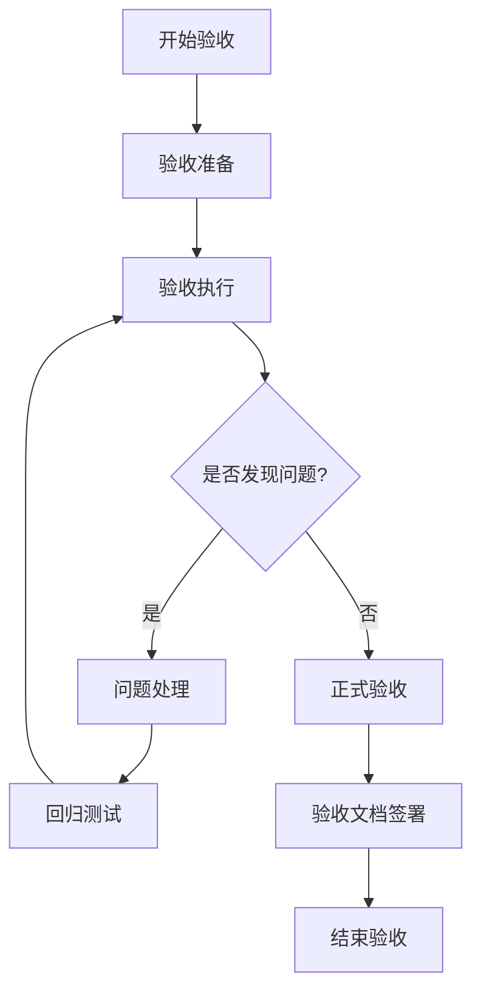
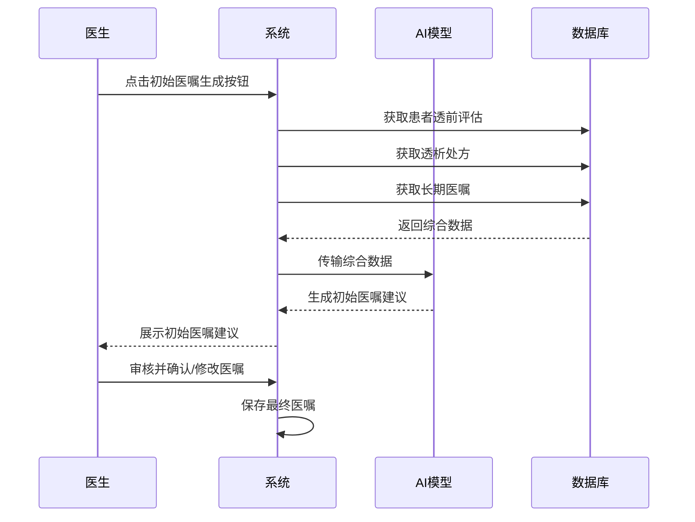
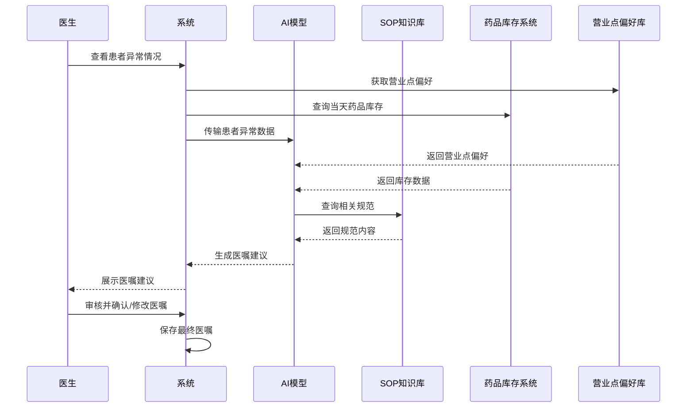
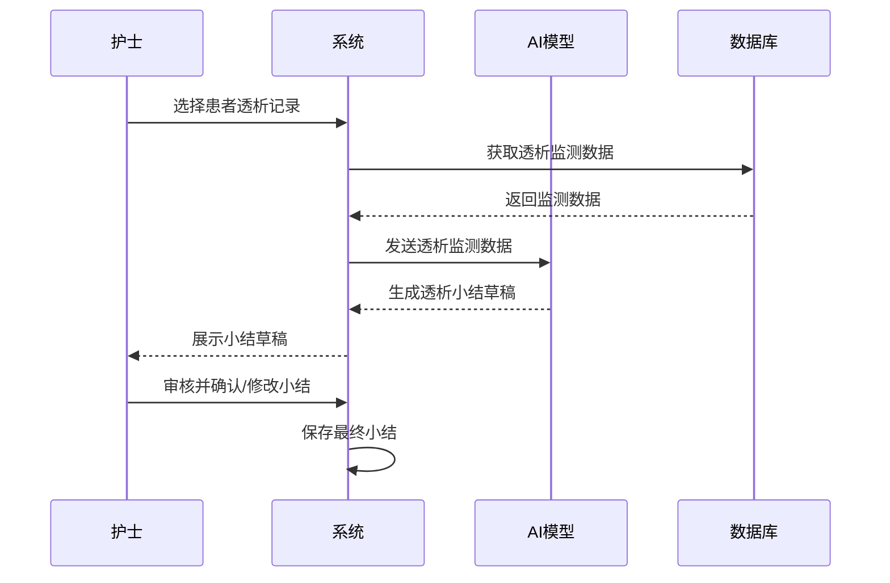
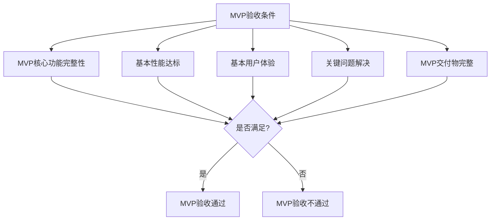
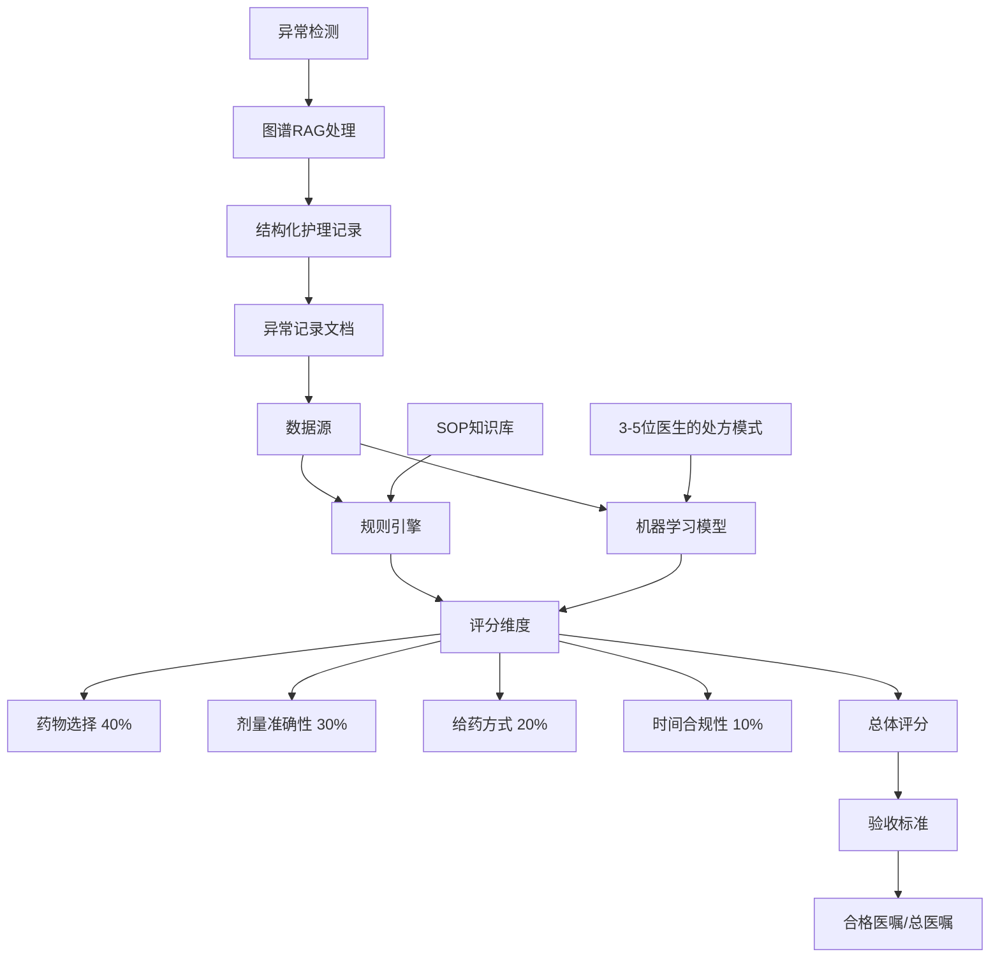
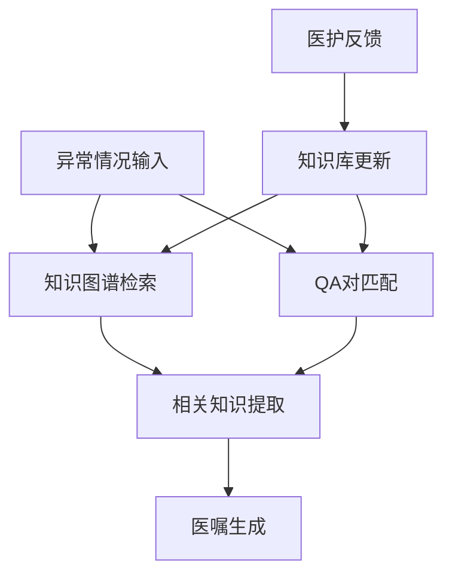
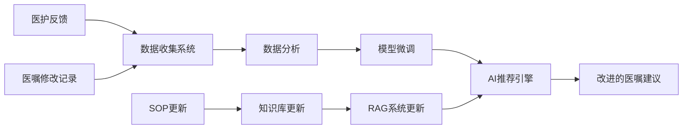

# 初始医嘱、临时医嘱和透析小结功能验收文档

## 1. 验收概述

### 1.1 验收目标与MVP策略

本验收旨在确认AI辅助初始医嘱生成、临时医嘱生成和透析小结生成功能的最小可行产品(MVP)是否按照需求规格说明书实现，并达到约定的基本质量标准。验收成功意味着系统的核心功能可以安全、有效地部署到生产环境，并为医护人员提供实际价值。

#### MVP验收策略
本验收文档采用MVP策略，聚焦于核心功能和必要测试用例，以加速产品交付和价值实现：

1. **聚焦核心功能**：明确标识MVP必要的功能点和验收标准
2. **简化验收流程**：缩短验收周期，减少不必要的测试环节
3. **降低准入门槛**：调整验收标准至合理可达成的水平
4. **分阶段交付**：先验收MVP核心功能，后续迭代完善扩展功能

### 1.2 验收范围

本次验收覆盖以下内容：
- **AI辅助医生生成初始医嘱功能**
- **AI辅助医生生成临时医嘱功能**
- **AI辅助护士生成透析小结功能**
- 系统与现有医疗系统的集成
- 用户界面和交互体验
- 系统性能与稳定性

### 1.3 验收团队

验收团队由以下角色组成：
- **产品负责人**：负责确认功能是否符合业务需求
- **技术负责人**：负责评估技术实现的质量和性能
- **医护代表**：负责评估初始医嘱和临时医嘱生成功能的临床适用性

### 1.4 验收流程

验收流程分为四个阶段：
1. **验收准备**：确认环境、测试数据和测试案例
2. **验收执行**：运行测试案例并记录结果
3. **问题处理**：解决发现的问题并进行回归测试
4. **正式验收**：确认所有标准都已满足，签署验收文档

## 2. 功能与需求验收

### 2.1 AI辅助医生生成初始医嘱功能（最高优先级）

#### 2.1.1 功能描述
系统通过AI技术，整合患者的透前评估结果、透析处方信息和长期医嘱数据，自动生成本次透析的初始医嘱，旨在提高医嘱生成的一致性和效率，减少医生手动录入的工作量。

#### 2.1.2 验收标准

| 类别 | 验收标准 | 验收方法 | 预期结果 | MVP必要 |
|------|---------|---------|---------|---------|
| 准确性 | 药品选择 | 检查推荐药品是否符合标准 | 65% | ✓ |
| 准确性 | 药品剂量 | 检查推荐剂量是否符合标准范围 | 65% | ✓ |
| 准确性 | 给药品方式 | 检查推荐给药方式是否符合标准范围 | 65% | ✓ |
| 准确性 | 药品时效 | 检查推荐时效是否符合标准范围 | 65% | ✓ |

### 2.2 AI辅助医生生成临时医嘱功能

#### 2.2.1 功能描述
系统通过AI技术，根据患者透析过程中的异常情况，辅助医生自动生成临时医嘱建议，提高医嘱开具的效率和规范性。系统会考虑当天药品库存情况，并根据不同营业点的医嘱偏好，为相同的临床情况提供符合当地习惯但药效等价的医嘱建议。

#### 2.2.2 验收标准

| 类别 | 验收标准 | 验收方法 | 预期结果 | MVP必要 |
|------|---------|---------|---------|---------|
| 准确性 | SOP符合度 | 检查推荐医嘱是否符合SOP规范 | ≥75% | ✓ |
| 相关性 | 对异常情况的响应相关性 | 评估推荐医嘱与输入异常情况的相关程度 | ≥75% | ✓ |
| 库存适应性 | 推荐药品库存可用率 | 检查推荐药品在当天库存中的可用情况 | ≥95% | ✓ |
| 营业点适应性 | 符合营业点偏好率 | 评估推荐医嘱与营业点历史偏好的符合程度 | ≥80% | ✓ |
| 用户体验 | 医生对推荐医嘱的采纳率 | 统计医生的实际采纳情况 | ≥75% | |

### 2.3 AI辅助护士生成透析小结功能

#### 2.3.1 功能描述
系统通过AI技术，根据透析全过程的监测数据和处置记录，辅助护士自动生成规范化的透析小结，提高工作效率和记录质量。

#### 2.3.2 验收标准

| 类别 | 验收标准 | 验收方法 | 预期结果 | MVP必要 |
|------|---------|---------|---------|---------|
| 完整性 | 必要字段填充完整率 | 检查生成小结的必要字段填充情况 | ≥90% | ✓ |
| 准确性 | 关键指标记录准确率 | 比对小结中的关键指标与原始监测数据 | ≥85% | ✓ |
| 用户体验 | 护士对生成小结的采纳率 | 统计护士的实际采纳情况 | ≥80% | |

## 3. 验收环境准备(待补充)
  需明确测试数据准备要求
## 4. 交付物清单

### 4.1 软件组件

| 交付物名称 | 说明 | 验收标准 |
|-----------|-----|---------|
| AI辅助初始医嘱生成模块 | 根据透前评估、透析处方和长期医嘱生成初始医嘱建议的AI模块 | 功能完整，符合2.1节验收标准 |
| AI辅助临时医嘱生成模块 | 根据透析异常数据生成临时医嘱建议的AI模块 | 功能完整，符合2.2节验收标准 |
| AI辅助小结生成模块 | 根据透析监测数据生成透析小结的AI模块 | 功能完整，符合2.3节验收标准 |
| 用户界面组件 | 医生和护士操作界面，包含AI辅助功能入口 | 符合UI设计规范，响应及时 |
| 系统集成API | 与现有系统交互的接口 | 接口文档完整，调用成功率≥99.9% |
| 数据处理服务 | 处理和转换各类输入数据的服务 | 处理准确率≥99.9% |

### 4.2 文档

| 交付物名称 | 说明 | 验收标准 |
|-----------|-----|---------|
| 系统设计文档 | 详细描述系统架构和实现方案 | 内容完整，符合文档标准 |
| 用户操作手册 | 面向医生和护士的系统使用指南 | 内容清晰，覆盖所有功能点 |
| API文档 | 系统提供的API接口说明 | 接口描述准确完整 |
| 部署文档 | 系统部署和配置说明 | 按文档能成功部署系统 |
| 测试报告 | 系统测试结果和质量评估 | 测试覆盖所有功能点 |

### 4.3 数据

| 交付物名称 | 说明 | 验收标准 |
|-----------|-----|---------|
| AI模型训练数据集 | 用于训练AI模型的标准化数据集 | 数据规模符合要求，质量合格 |
| 知识库 | 结构化的SOP知识库和医嘱字典 | 覆盖常见透析异常处理规范 |
| 测试数据集 | 用于系统测试的样本数据 | 覆盖各类测试场景 |

## 5. 验收测试计划

### 5.1 简化测试进度 (MVP验收)

| 测试阶段 | 计划天数 | 主要活动 | 完成标准 |
|---------|---------|---------|---------|
| 环境准备 | 0.5天 | 配置测试环境，导入测试数据 | 环境就绪，数据可用 |
| 功能测试 | 1天 | 执行MVP核心功能测试用例 | 所有MVP用例执行完毕 |
| 用户体验测试 | 1天 | 医护人员参与的实际使用测试 | 收集到关键用户反馈 |
| 问题修复与回归 | 1.5天 | 解决关键问题并回归测试 | 所有阻断性问题修复完毕 |
| 正式验收 | 0.5天 | 最终验收测试和文档确认 | 验收文档签署完成 |

```mermaid
gantt
    title MVP验收测试进度计划
    dateFormat D
    axisFormat %d

    section 测试准备
    环境准备           :a1, 0, 0.5d
    section 测试执行
    MVP功能测试        :a2, after a1, 1d
    用户测试           :a3, after a2, 1d
    section 问题处理
    修复与回归测试      :a4, after a3, 1.5d
    section 验收确认
    验收确认           :a5, after a4, 0.5d
```

**总验收周期：4.5天**
## 6. 测试用例(待补充)
  需补充异常场景测试案例（如低血压、肌肉痉挛等并发症处理）
## 7. 问题跟踪与解决

### 7.1 问题分类标准

| 问题级别 | 定义 | 修复时限 | 验收要求 |
|---------|-----|---------|---------|
| P0(阻断) | 系统无法运行或核心功能完全无法使用 | 当日 | 100%修复 |
| P1(严重) | 核心功能严重受损但有临时解决方案 | 24小时内 | 100%修复 |
| P2(中等) | 功能可用但存在明显缺陷或不便 | 3个工作日内 | ≥95%修复 |
| P3(轻微) | 小问题或优化建议，不影响正常使用 | 下一版本计划 | ≥80%修复 |

### 7.2 解决流程

1. **问题报告**：
   - 记录问题详情(现象、复现步骤、影响)
   - 分配问题级别
   - 指定负责人

2. **问题处理**：
   - 问题分析和根本原因确定
   - 制定修复方案
   - 实施修复

3. **修复验证**：
   - 验证修复结果
   - 执行回归测试
   - 更新问题状态

### 7.3 验收标准

验收前，问题解决必须满足以下标准：
- P0和P1级问题：100%修复并验证通过
- P2级问题：≥95%修复并验证通过
- P3级问题：≥80%修复或有明确修复计划
- 所有修复通过回归测试，不引入新问题

## 8. 验收确认

### 8.1 MVP验收条件

系统MVP验收必须满足以下条件：

1. **MVP核心功能完整性**：
   - 所有MVP核心功能（初始医嘱生成、临时医嘱生成、透析小结生成）通过测试
   - MVP功能验收标准达标率≥90%
   - 所有标记为"MVP必要"的测试用例全部通过

2. **基本性能达标**：
   - MVP核心性能指标达标
   - 系统在基本负载下稳定运行

3. **基本用户体验**：
   - 医生和护士能够完成基本工作流程
   - 用户反馈无严重阻碍使用的问题

4. **关键问题解决**：
   - 所有P0(阻断)和P1(严重)问题100%修复
   - P2(中等)问题修复率≥80%
   - P3(轻微)问题可延后解决

5. **MVP交付物完整**：
   - 所有MVP必要交付物完整提交
   - 核心文档齐全且准确

### 8.2 签署流程

验收签署将按以下流程进行：

1. **技术验收**：
   - 技术负责人确认技术实现符合要求
   - 技术验收报告签署

2. **用户验收**：
   - 医生和护士代表确认功能满足临床需求
   - 用户验收报告签署

3. **管理验收**：
   - 项目管理方确认项目交付完整
   - 管理验收报告签署

4. **最终验收**：
   - 各方代表共同确认系统满足所有验收条件
   - 正式验收文档签署

### 8.3 确认文档

验收完成后，需由各方代表签署以下确认文档：

#### 8.3.1 验收测试报告

包含以下内容：
- 验收测试执行情况统计
- 测试案例通过率
- 发现的问题清单及解决状态
- 性能测试结果分析
- 用户体验测试结果分析

#### 8.3.2 验收确认书

| 角色 | 姓名 | 单位 | 日期 | 签名 |
|-----|-----|------|-----|-----|
| 产品负责人 |  |  |  |  |
| 技术负责人 |  |  |  |  |
| 医生代表 |  |  |  |  |
| 护士代表 |  |  |  |  |

## 9. 医嘱评价模型规范

### 9.1 核心评价框架

### 9.2 评价指标与标准

#### 9.2.1 评分系统（100分制）

| 维度 | 权重 | 评价标准 | 扣分项 |
|-----------|--------|---------------------|------------------|
| **药物选择** | 40% | - 针对病情的正确药物 - SOP合规性 - 禁忌症检查 | -20 错误药物 -15 非SOP推荐药物 -10 未检出禁忌症 |
| **剂量准确性** | 30% | - 在推荐范围内 - 需要时进行体重调整 - 浓度适当 | -15 剂量超出范围 -10 缺少体重调整 -5 浓度不适当 |
| **给药方式** | 20% | - 正确给药途径 - 适当给药时机 - 输液速率（如适用） | -10 错误给药途径 -5 不适当给药时机 -5 错误输液速率 |
| **时间合规性** | 10% | - 紧急情况响应时间 - 顺序正确性 - 持续时间适当性 | -5 响应延迟 -3 顺序不正确 -2 持续时间不适当 |

#### 9.2.2 验收标准

- **第一版（静默模式）:**
  - 合格医嘱率: ≥75%（得分≥80分）
  - 从3-5位医生的处方模式中学习
  - 验收不使用主观评价

- **未来目标:**
  - 合格医嘱率: ≥98%
  - 从反馈中持续学习

### 9.3 万邦对接实施策略

#### 9.3.1 功能点

1. **统计指标定义:**
   - 建立明确的药物选择、剂量、给药方式指标
   - 定义SOP合规性计算方法
   - 创建异常-响应相关性指标

2. **评价标准:**
   - 实施初始部署的静默评价模式
   - 基于SOP指南开发自动评分系统
   - 从3-5位经验丰富的医生创建参考数据库

3. **量化对比:**
   - 跟踪医护人员的采纳率
   - 测量AI建议与最终医嘱之间的编辑距离
   - 计算与手动录入医嘱相比节省的时间

#### 9.3.2 实施时间表

| 阶段 | 持续时间 | 交付物 |
|-------|----------|---------------|
| 需求确定 | 2周 | 统计指标定义，评价标准文档 |
| 模型开发 | 6周 | 医嘱评价的规则引擎，机器学习模型 |
| 万邦系统集成 | 4周 | API开发，数据交换协议 |
| 静默模式测试 | 4周 | 评价报告，性能指标 |
| 部署与培训 | 2周 | 系统部署，用户培训材料 |

### 9.4 异常处理与自我学习增强

#### 9.4.1 图谱RAG实现

系统采用图谱增强检索增强生成(RAG)技术，提高异常处理的准确性：

- 构建透析并发症知识图谱，包含症状、原因和处理方案
- 将SOP规范以QA对形式存储，支持精准检索
- 为常见透析并发症（如低血压、肌肉痉挛、头痛等）创建结构化处理模板

#### 9.4.2 语音输入与多模态交互

为提高医护工作效率，系统支持多种输入方式：

- 语音识别：医护人员可通过语音快速记录异常情况
- 结构化模板：常见并发症可通过点选方式快速录入
- 自然语言处理：支持医护人员使用日常医疗用语描述情况

#### 9.4.3 营业点个性化适应

系统能够识别并适应不同营业点的医嘱偏好：

- 自动学习各营业点常用药物组合和剂量习惯
- 在保证医疗质量的前提下，推荐符合当地习惯的药物
- 当库存不足时，智能推荐药效等价的替代方案

这种个性化适应既尊重了医护人员的专业习惯，又确保了医嘱的规范性和可执行性，大大提高了系统的实用价值和接受度。

### 9.5 自我学习与持续改进机制

#### 9.5.1 自我学习系统架构

系统采用双轨自我学习机制，确保持续提升医嘱生成质量：

1. **基于SOP的RAG知识库**：
   - 以问答对(QA)形式构建结构化知识库
   - 针对常见透析并发症建立标准处理流程
   - 支持医护人员通过自然语言查询获取规范建议

2. **基于实践的模型微调**：
   - 从3-5位资深医生的处方模式中学习最佳实践
   - 收集医护人员对AI建议的接受/修改数据
   - 定期进行模型微调，提高推荐准确性

#### 9.5.2 医护友好的反馈机制

为确保系统持续学习，设计了简单直观的反馈收集方式：

1. **一键评价**：医护人员可通过1-5星评分快速评价AI建议质量
2. **简化修改跟踪**：系统自动记录医护人员对AI建议的修改，无需额外操作
3. **语音反馈**：支持医护人员通过语音快速提供改进建议

#### 9.5.3 持续改进路线图

| 阶段 | 主要目标 | 改进重点 |
|------|---------|---------|
| 初始阶段 | 建立基础模型和知识库 | 收集基础数据，构建核心QA对 |
| 静默学习期 | 积累医护修改数据 | 分析修改模式，识别系统弱点 |
| 首次微调 | 提高基础准确率 | 针对高频修改点进行模型调整 |
| 持续优化 | 提高个性化推荐能力 | 学习不同营业点和医生偏好 |
| 高级阶段 | 预测医疗需求变化 | 根据季节性变化等因素主动调整推荐 |

随着系统成熟度提高，验收标准将逐步提升，最终目标是达到98%以上的医嘱准确率和90%以上的医护采纳率。

