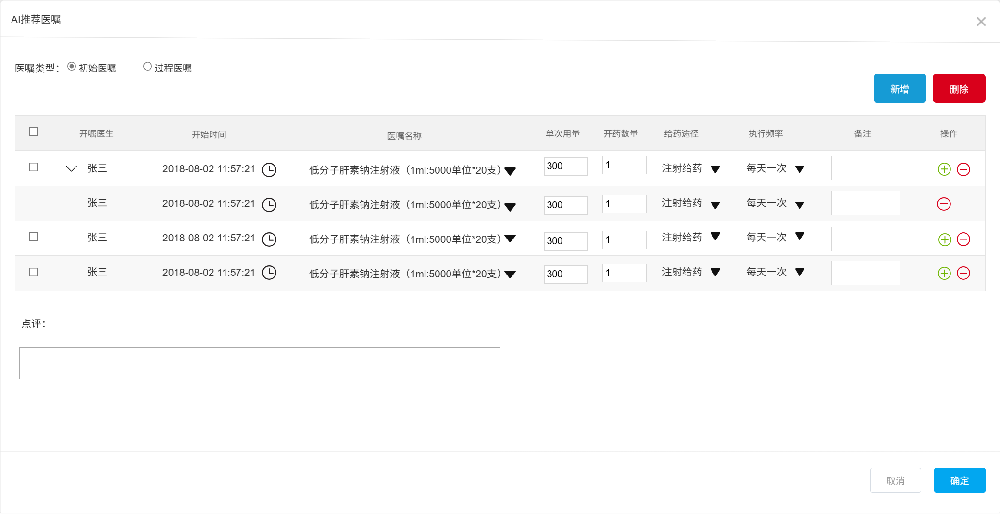

# AI辅助医嘱与透析小结系统 医护研讨文档

## 1. 三大核心功能介绍与展示

本系统聚焦于血液透析中心三大AI辅助功能，旨在提升医护工作效率、医嘱规范性及医疗安全性：

### 1.1 AI辅助医生生成初始医嘱
- **功能简介**：系统自动整合患者透前评估、透析处方及长期医嘱信息，智能生成本次透析的初始医嘱建议。医生可一键采纳或根据患者具体情况进行个性化调整。
- **界面展示**：在医嘱录入界面，点击"生成初始医嘱"

### 1.2 AI辅助医生生成异常医嘱
- **功能简介**：透析过程中如患者出现低血压、肌肉痉挛等并发症，医生可点击"AI辅助生成异常医嘱"，系统结合SOP、药品库存及院区用药习惯，推荐规范化、可执行的处理方案。
- **界面展示**：异常事件录入后，系统自动弹出异常医嘱建议，医生可快速采纳、编辑或选择多种处理方案。

### 1.3 AI辅助护士生成透析小结
- **功能简介**：透析结束后，系统自动汇总监测数据、护理操作记录及医嘱执行情况，生成结构化透析小结草稿。护士可直接审核、补充并归档，确保小结内容完整、规范。
- **界面展示**：在小结界面点击"生成小结"，系统自动填充标准化模板，护士可一键确认或补充说明。

## 2. 典型临床应用场景

- **初始医嘱制定**：患者入院登记后，医生通过AI一键生成本次透析初始医嘱，减少重复录入，提升医嘱一致性与规范性。
- **异常医嘱调整**：透析过程中如出现低血压、抽搐等并发症，医生快速录入异常，系统即时推荐符合SOP的处理医嘱，提升响应速度与安全性。
- **透析小结归档**：透析结束后，护士通过AI自动生成小结，自动提取关键指标和异常处理记录，提升护理文书质量与归档效率。

## 3. 量化成效与临床价值

- **效率提升**：初始医嘱、异常医嘱及透析小结生成平均用时缩短40%~50%。
- **规范性提升**：AI推荐医嘱SOP符合率≥75%，透析小结完整性≥90%。
- **安全性提升**：通过自动冲突检测、禁忌提示等功能，降低用药及操作风险。

## 4. 医护配合资源与时间安排

- **需求分析与规则梳理**：医生、护士代表参与需求确认、规则审核（每人每周4-6小时，1周）。
- **数据准备与标注**：协助筛选典型病例、审核医嘱和小结数据（每人每周2-3小时，2周）。
- **功能测试与反馈**：参与系统功能测试、采纳率和满意度评估（每人每周6-8小时，2周）。
- **持续反馈**：系统上线后定期参与反馈与优化建议（每月1小时）。

## 5. AI系统自我学习与持续优化策略

### 5.1 系统特色与创新点

- **多源数据融合**：系统自动整合患者透前评估、透析处方、长期医嘱、实时监测数据、SOP知识库、药品库存及院区用药偏好，实现全流程智能辅助决策。
- **规则与模型结合**：采用"规则引擎+微调大模型"双轨架构，兼顾医疗规范的可解释性与AI推荐的持续优化能力。
- **静默学习与闭环反馈**：系统后台自动比对AI推荐医嘱与医护实际医嘱，静默评分，所有AI建议均需医护审核确认，系统自动记录采纳与修改，形成持续学习闭环。
- **个性化与本地化适应**：系统自动学习不同院区及医生的用药习惯，在保证规范前提下，推荐更贴合实际的医嘱方案。
- **异常场景智能处理**：针对透析并发症，系统可快速响应并给出SOP合规处理建议，支持后续语音录入和多模态交互，提升医护效率。

### 5.2 自我学习与持续优化机制

#### 5.2.1 双轨自我学习架构

1. **基于SOP的知识库增强检索（RAG）**
   - 以问答对(QA)形式构建结构化知识库，覆盖常见透析并发症、药物使用规范等。
   - 支持AI在生成医嘱时，实时检索最新SOP和临床指南，确保推荐内容始终合规、权威。
   - 医护可通过自然语言提问，获得标准化建议，提升系统可解释性和信任度。

2. **基于医护行为的模型微调**
   - 系统自动收集医护对AI建议的采纳、修改、评价等行为数据。
   - 定期分析采纳率、编辑距离、常见修改点，识别AI推荐的薄弱环节。
   - 结合3-5位资深医生的处方模式，作为"标准答案"对比，指导模型微调和优化。
   - 持续迭代，提升AI对本地临床实际的适应性和准确率。

#### 5.2.2 反馈采集与闭环优化

- **一键评价**：医护可对AI建议进行1-5星快速评价，便于系统收集主观满意度。
- **自动记录修改**：系统自动追踪医护对AI建议的每一次编辑，量化采纳率与编辑距离。
- **语音/文本反馈**：支持医护通过语音或文本方式反馈AI建议的不足或改进建议。
- **定期数据分析**：每周/每月自动生成采纳率、合格率、常见问题等分析报告，指导产品和模型优化。

#### 5.2.3 持续改进路线图

| 阶段         | 主要目标             | 改进重点                         |
| ------------ | ------------------- | -------------------------------- |
| 初始阶段     | 建立基础模型和知识库 | 收集基础数据，构建核心问答对       |
| 静默学习期   | 积累医护修改数据     | 分析修改模式，识别系统薄弱环节   |
| 首次微调模型 | 提高基础准确率       | 针对高频修改点进行模型调整       |
| 持续优化     | 提高个性化推荐能力   | 学习不同院区和医生用药偏好       |
| 高级阶段     | 预测医疗需求变化     | 根据历史数据主动预警高危风险     |

- 随着数据积累和模型优化，系统目标是将AI推荐医嘱的合格率从MVP阶段的75%逐步提升至90%以上。

### 5.3 AI医疗领域成功案例与实际成效

- **国际案例**：如Mayo Clinic、Johns Hopkins等国际知名医院已广泛应用AI辅助决策系统，实现药物推荐、异常预警、文书自动生成等功能，显著提升医疗安全与效率。
- **国内案例**：国内多家三甲医院已上线AI辅助用药系统，部分场景下AI推荐合格率达95%以上，医生采纳率超过85%，有效减少用药错误和文书遗漏。
- **本系统预期成效**：
  - **效率提升**：初始医嘱、异常医嘱和小结生成平均用时缩短40-50%。
  - **规范性提升**：AI推荐医嘱SOP符合率目标≥85%，小结完整性≥90%。
  - **安全性提升**：通过自动冲突检测、禁忌提示等功能，降低用药风险。

## 6. <u>初始医嘱验收标准与评价体系</u>

### 6.1 <u>三大功能点的统计口径</u>

- ##### <u> 6.1.1 初始医嘱:每周推荐合格(≥75分)医嘱数 / 每周总推荐医嘱数</u>
- ##### <u> 6.1.2 异常医嘱:每周推荐合格(符合SOP规范)医嘱数 / 每周总推荐医嘱数</u>
       SOP:<<血液净化标准操作规程（2021版>>
- ##### <u> 6.1.3 透析小结:每周推荐合格(字段无遗漏)透析小结 / 每周总推荐透析小结</u>

### 6.2 <u>三大功能点的评价打分体系</u>

- <u>静默评价：系统后台对每条AI推荐医嘱进行100分制打分，采用扣分制，具体维度、权重、扣分标准等需与医护团队进一步沟通确认。</u>

| 维度         | 权重  | 扣分项示例                |
| ------------ | ----- | ------------------------- |
| 药物选择     | 60%   | 错误药物-30，非SOP-15    |
| 剂量准确性   | 15%   | 超范围-15，未调体重-10   |
| 用法/途径    | 15%   | 错误途径-10，时机不当-5  |
| 时间合规性   | 10%   | 响应延迟-5，顺序不对-5   |

- <u>合格医嘱定义：得分≥75分为合格，合格率目标≥75%（MVP），未来目标≥90%。</u>

### 6.3 <u>推荐初始医嘱的规则</u>

- <u>推荐初始医嘱的生成规则，包括主要参考透析处方中的哪些字段（如透析方式、抗凝方案、透析液成分、血流量、目标脱水量等）、生成逻辑、差异标注方式等，需与医护团队详细讨论确认。</u>

### 6.4 参考医生开药结果

- 学习机制：系统每周采集3-5位医生的实际开药结果，作为"标准答案"对比与学习，持续优化AI推荐。
- 量化对比：统计AI推荐与医生实际开药的编辑距离、采纳率、节省时间等，定期向医护反馈改进成效。

## 8. 当前处理逻辑与方法

为便于与医护团队充分沟通，现将系统当前在核心环节的处理逻辑与方法简要说明如下：

### 8.1 统计口径
- 目前系统以"每周推荐合格医嘱数/每周总推荐医嘱数"作为主要统计指标，合格标准为AI评分≥75分。
- 统计周期为自然周，样本范围为所有通过AI推荐并由医护审核的医嘱。
- 特殊病例（如极端异常、特殊透析方案）暂未单独设定统计口径。

### 8.2 评价打分体系
- 采用100分制静默评价，后台自动对每条AI推荐医嘱进行多维度扣分。
- 主要维度包括：药物选择（60%）、剂量准确性（15%）、用法/途径（15%）、时间合规性（10%）。
- 扣分标准参考SOP、临床指南及历史医嘱数据，合格线为75分。
- 目前以客观规则为主

### 8.3 推荐初始医嘱的规则
- 推荐逻辑主要基于患者透析处方（如透析方式、抗凝方案、透析液成分、血流量、目标脱水量等）、透前评估和长期医嘱。
- 系统自动比对长期医嘱与本次透析需求，识别需调整项目，生成个性化建议。
- 差异项会在界面中高亮标注，供医生审核。
- 生成逻辑以SOP和本地用药习惯为基础，特殊情况由医生人工干预。

### 8.4 异常事件录入与后补机制
- 透析过程中如出现低血压、抽搐等并发症，护士/医生需及时录入异常事件。
- 支持异常事件后补录，系统保留补录时间戳。
- 后续试点语音录入功能，提升异常事件记录效率。

### 8.5 反馈采集与持续优化
- 系统自动记录医护对AI建议的采纳、修改、评价等行为。
- 采纳率、满意度、编辑距离等数据定期分析，作为模型优化依据。
- 支持一键评价、文本/语音反馈，便于医护提出改进建议。

## 9. 待讨论确认问题列表

为确保系统功能、评价体系及规则设计充分贴合临床实际，建议在医护研讨会中重点讨论以下问题（建议每个议题20分钟）：

1. <u>功能点的统计口径如何定义？</u>
   - 例如：统计周期(周)、样本范围(推荐数据)、合格标准(评分、SOP、完整)特殊病例如何处理是否计入等。
      - <u>初始医嘱:每周推荐合格(≥75分)医嘱数 / 每周总推荐医嘱数</u>
      - <u>异常医嘱:每周推荐合格(符合SOP规范)医嘱数 / 每周总推荐医嘱数</u>
       参考:<<血液净化标准操作规程（2021版>>
      - <u> 透析小结:每周推荐合格(字段无遗漏)透析小结数 / 每周总推荐透析小结数</u>
2. <u>功能点的评价打分体系如何设定？</u>
   - 包括各维度权重、扣分标准、合格线、主观与客观评价结合方式等。
   
- <u>静默评价：系统后台对每条AI推荐医嘱进行100分制打分，采用扣分制，具体维度、权重、扣分标准等需与医护团队进一步沟通确认。</u>

| 维度         | 权重  | 扣分项示例                |
| ------------ | ----- | ------------------------- |
| 药物选择     | 60%   | 错误药物-30，非SOP-15    |
| 剂量准确性   | 15%   | 超范围-15，未调体重-10   |
| 用法/途径    | 15%   | 错误途径-10，时机不当-5  |
| 时间合规性   | 10%   | 响应延迟-5，顺序不对-5   |
| 其他   |  N/A   |  N/A  |

- <u>合格医嘱定义：得分≥75分为合格，合格率目标≥75%（MVP），未来目标≥90%。</u>
3. <u>推荐初始医嘱的规则与生成逻辑如何确定？</u>
   - 
   

