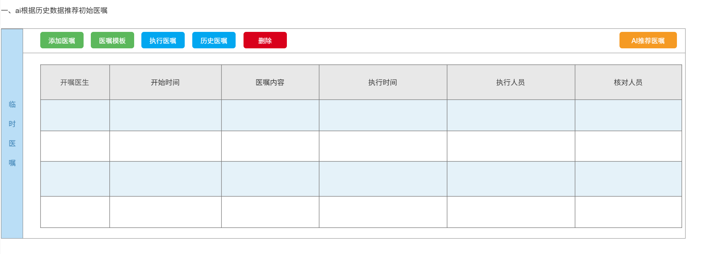
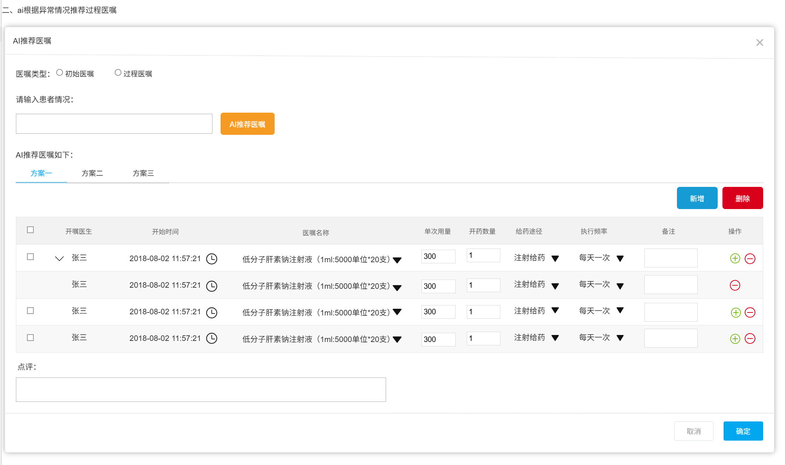

# AI辅助医嘱与透析小结系统 - 项目计划书

## 1. 项目范围

### 1.1 AI辅助医生生成初始医嘱
- **应用场景**: 患者入院登记后，医生通过AI一键生成本次透析初始医嘱，减少重复录入，提升医嘱一致性与规范性。
- **功能简介**：系统自动整合患者透前评估、透析处方及长期医嘱信息，智能生成本次透析的初始医嘱建议。医生可一键采纳或根据患者具体情况进行个性化调整。
- **界面展示**：

  
  图1 AI推荐初始医嘱界面1

  
  图2 AI推荐初始医嘱界面2

### 1.2 AI辅助医生生成异常医嘱
- **应用场景**: 透析过程中如患者出现低血压、肌肉痉挛等并发症，医生可点击"AI辅助生成异常医嘱"，系统结合SOP、药品库存及院区用药习惯，推荐规范化、可执行的处理方案。
- **功能简介**：透析过程中如患者出现低血压、肌肉痉挛等并发症，医生可点击"AI辅助生成异常医嘱"，系统结合SOP、药品库存及院区用药习惯，推荐规范化、可执行的处理方案。
- **界面展示**：

  
图3 AI推荐异常医嘱界面

### 1.3 AI辅助护士生成透析小结
- **应用场景**: 透析结束后，护士通过AI自动生成小结，自动提取关键指标和异常处理记录，提升护理文书质量与归档效率。
- **功能简介**：透析结束后，系统自动汇总监测数据、护理操作记录及医嘱执行情况，生成结构化透析小结草稿。护士可直接审核、补充并归档，确保小结内容完整、规范。
- **界面展示**：

  
  图4 AI推荐透析小结界面

---

## 2. 项目预期成果、评价标准与验收标准

### 2.1 AI辅助医生生成初始医嘱
- **预期成果**: 初始医嘱生成平均用时缩短40%~50%，AI推荐医嘱SOP符合率≥75%。
- **评价标准与验收标准**:
    - **统计口径：**
        - 统计周期：每周
        - 统计公式：每周推荐合格医嘱数 / 每周总推荐医嘱 ≥ **75%**
    - **静默评价：**
        - 系统后台对每条AI推荐医嘱进行100分制打分，采用扣分制。
    | **维度**     | **权重** | **扣分项示例**            |
    | ------------ | ------- | ------------------------- |
    | 药物选择     | 60%     | 错误药物-30，非SOP-15    |
    | 剂量准确性   | 15%     | 超范围-15，未调体重-10   |
    | 用法/途径    | 15%     | 错误途径-10，时机不当-5  |
    | 时间合规性   | 10%     | 响应延迟-5，顺序不对-5   |
    - **合格医嘱定义：** 得分≥**75**分为合格，合格率需≥**75%**（MVP）。
- **达成时间投入**:
    - 基本交付 (AI推荐准确率75%): 8月2日

### 2.2 AI辅助医生生成异常医嘱
- **预期成果**: 异常医嘱生成平均用时缩短40%~50%，AI推荐医嘱SOP符合率≥75%。
- **评价标准与验收标准**:
    - **统计口径：**
        - 统计周期：每周
        - 统计公式：每周推荐合格（符合SOP规范）医嘱数 / 每周总推荐医嘱数 ≥ **75%** （参考《血液净化标准操作规程（2021版）》）
- **达成时间投入**:
    - 基本交付 (AI推荐准确率75%): 8月2日 (与初始医嘱同步)

### 2.3 AI辅助护士生成透析小结
- **预期成果**: 透析小结生成平均用时缩短40%~50%，透析小结完整性≥90%。
- **评价标准与验收标准**:
    - **统计口径：**
        - 统计周期：每周
        - 统计公式：每周推荐合格（字段无遗漏，编辑距离达标）透析小结数 / 每周总推荐透析小结数 ≥ **75%**
    - **编辑距离**: (具体计算方法待定义，目标75%相似度)
- **达成时间投入**:
    - 基本交付 (AI草稿，完整性及编辑距离达标): 6月30日

### 2.4 准确率调优 (所有功能)
- **预期成果**: AI推荐准确率从75%提升至90%以上。
- **评价标准与验收标准**: 各功能点评价标准中的合格率目标提升至≥**90%**。
- **达成时间投入**: 3个月 (预计10月31日完成)
    - **前置条件**: 医护团队需要将病人的信息完整记录，例如病情改变、个人情况、病人的想法或者要求。

---

## 3. 项目资源投入

### 3.1 医护配合资源与时间安排
- **需求分析与规则梳理**：医生、护士代表参与需求确认、规则审核（每人每周4-6小时，1周）。
- **数据准备与标注**：协助筛选典型病例、审核医嘱和小结数据（每人每周2-3小时，2周）。
- **功能测试与反馈**：参与系统功能测试、采纳率和满意度评估（每人每周6-8小时，2周）。
- **持续反馈**：系统上线后定期参与反馈与优化建议（每月1小时）。
- **场景1 (初始医嘱+异常医嘱) 医护配合投入时间**: 60人时（每周10人时）
- **场景2 (透析小结) 医护配合投入时间**: 25人时（每周5人时）

### 3.2 物质资源与费用
- **建模费用**: ¥2万/次，预计5次 (共计 ¥10万)
- **微调费用**: ¥1.5万/次，预计12次 (共计 ¥18万)
- **云服务费用**: (需要详细列出，例如：阿里云相关服务租用费用)
- **高管培训**: 半天 (包含在项目内)

---

## 4. 项目里程碑

| **阶段**         | **交付物**                                     | **计划完成时间** | **负责人** |
| ---------------- | ---------------------------------------------- | --------------- | -------- |
| **第一阶段：基本交付** |                                                |                 |          |
| 里程碑1          | 透析小结 - AI草稿 (准确率75%)                  | 6月30日         |          |
| 里程碑2          | 初始医嘱+异常医嘱 - AI推荐 (准确率75%)        | 8月2日          |          |
| 里程碑3          | 高管培训                                       | 6月3日          |          |
| **第二阶段：准确率调优** |                                                |                 |          |
| 里程碑4          | 所有功能AI推荐准确率达到90%以上                | 10月31日        |          |
| **持续优化阶段** |                                                |                 |          |
| 定期             | 系统自我学习与持续优化 (基于反馈)              | 持续            |          |

---

## 5. 项目风险点与应对方案

| **风险点**             | **可能性** | **影响程度** | **应对方案**                                                                 |
| ---------------------- | -------- | -------- | ---------------------------------------------------------------------------- |
| 数据质量不足           | 中       | 高       | 1. 明确数据录入规范和要求；2. 加强医护培训，确保信息完整准确；3. 建立数据校验机制。     |
| 开发进度延误           | 中       | 中       | 1. 制定详细排期，预留缓冲时间；2. 定期跟进进度，及时调整资源；3. 优先保障核心功能。 |
| 模型训练/微调效果不达标 | 中       | 高       | 1. 准备高质量、多样化的训练数据；2. 引入多种模型和算法进行尝试；3. 增加迭代次数和调优轮次。 |
| 验收标准模糊或难以达到 | 低       | 高       | 1. 在项目初期共同明确和量化验收标准；2. 分阶段验收，及时反馈和调整。                  |
| 医护配合时间不足       | 中       | 中       | 1. 与医院管理层沟通，争取足够支持；2. 优化协作流程，提高效率；3. 提前规划，错峰安排。 |
| 费用超出预算           | 低       | 中       | 1. 详细规划各项费用，留有预备金；2. 定期监控支出，及时预警；3. 寻找性价比更高的替代方案。 |
| **前置条件未满足**     |          |          |                                                                              |
|  - 医护未完整记录信息    | 中       | 高       | 1. 强调信息完整性的重要性；2. 提供便捷的记录工具和方法；3. 纳入绩效考核。          |
|  - 无法读取生产数据库   | 低       | 极高     | 1. 尽早与IT部门沟通，获取必要权限和接口；2. 制定备用数据获取方案。                   |

---

## 6. AI系统自我学习与持续优化策略 (保留原有内容，略作调整)

### 6.1 系统特色与创新点

- **多源数据融合**：系统自动整合患者透前评估、透析处方、长期医嘱、实时监测数据、SOP知识库、药品库存及院区用药偏好，实现全流程智能辅助决策。
- **规则与模型结合**：采用"规则引擎+微调大模型"双轨架构，兼顾医疗规范的可解释性与AI推荐的持续优化能力。
- **静默学习与闭环反馈**：系统后台自动比对AI推荐医嘱与医护实际医嘱，静默评分，所有AI建议均需医护审核确认，系统自动记录采纳与修改，形成持续学习闭环。
- **个性化与本地化适应**：系统自动学习不同院区及医生的用药习惯，在保证规范前提下，推荐更贴合实际的医嘱方案。
- **异常场景智能处理**：针对透析并发症，系统可快速响应并给出SOP合规处理建议，支持后续语音录入和多模态交互，提升医护效率。

### 6.2 自我学习与持续优化机制

#### 6.2.1 双轨自我学习架构

1. **基于SOP的知识库增强检索（RAG）**
   - 以问答对(QA)形式构建结构化知识库，覆盖常见透析并发症、药物使用规范等。
   - 支持AI在生成医嘱时，实时检索最新SOP和临床指南，确保推荐内容始终合规、权威。
   - 医护可通过自然语言提问，获得标准化建议，提升系统可解释性和信任度。

2. **基于医护行为的模型微调**
   - 系统自动收集医护对AI建议的采纳、修改、评价等行为数据。
   - 定期分析采纳率、编辑距离、常见修改点，识别AI推荐的薄弱环节。
   - 结合3-5位资深医生的处方模式，作为"标准答案"对比，指导模型微调和优化。
   - 持续迭代，提升AI对本地临床实际的适应性和准确率。

#### 6.2.2 反馈采集与闭环优化

- **一键评价**：医护可对AI建议进行1-5星快速评价，便于系统收集主观满意度。
- **自动记录修改**：系统自动追踪医护对AI建议的每一次编辑，量化采纳率与编辑距离。
- **语音/文本反馈**：支持医护通过语音或文本方式反馈AI建议的不足或改进建议。
- **定期数据分析**：每周/每月自动生成采纳率、合格率、常见问题等分析报告，指导产品和模型优化。

#### 6.2.3 持续改进路线图

| **阶段**     | **主要目标**         | **改进重点**                   | **预期合格率** |
| ------------ | ------------------- | ------------------------------ | ------------ |
| 初始阶段     | 建立基础模型和知识库 | 收集基础数据，构建核心问答对   | MVP: 75%     |
| 静默学习期   | 积累医护修改数据     | 分析修改模式，识别系统薄弱环节 |              |
| 首次微调模型 | 提高基础准确率       | 针对高频修改点进行模型调整     | >80%         |
| 持续优化     | 提高个性化推荐能力   | 学习不同院区和医生用药偏好     | >85%         |
| 高级阶段     | 预测医疗需求变化     | 根据历史数据主动预警高危风险   | >90%         |

> 随着数据积累和模型优化，系统目标是将AI推荐医嘱的合格率从MVP阶段的**75%**逐步提升至**90%**以上。

### 6.3 AI医疗领域成功案例与实际成效 (参考)

- **国际案例**：如Mayo Clinic、Johns Hopkins等国际知名医院已广泛应用AI辅助决策系统，实现药物推荐、异常预警、文书自动生成等功能，显著提升医疗安全与效率。
- **国内案例**：国内多家三甲医院已上线AI辅助用药系统，部分场景下AI推荐合格率达**95%**以上，医生采纳率超过**85%**，有效减少用药错误和文书遗漏。
- **本系统预期成效 (回顾)**：
  - **效率提升**：初始医嘱、异常医嘱和小结生成平均用时缩短**40-50%**。
  - **规范性提升**：AI推荐医嘱SOP符合率目标≥**85%** (调优后)，小结完整性≥**90%**。
  - **安全性提升**：通过自动冲突检测、禁忌提示等功能，降低用药及操作风险。

---
## 7. 待讨论确认问题列表 (保留原有内容，供后续细化)

### 7.1 功能点统计口径如何定义？

> **统计口径需明确以下要素：**
> - 统计周期（如：周）
> - 样本范围（推荐数据）
> - 合格标准（评分、SOP、完整性、编辑距离）
> - 特殊病例如何处理是否计入等

**各功能点合格率定义 (已整合入第二部分，此处可作细化讨论备份)：**

- **初始医嘱**：每周推荐合格（≥75分）医嘱数 / 每周总推荐医嘱数 ≥ **75%** (MVP)
- **异常医嘱**：每周推荐合格（符合SOP规范）医嘱数 / 每周总推荐医嘱数 ≥ **75%** (MVP) （参考《血液净化标准操作规程（2021版）》）
- **透析小结**：每周推荐合格（字段无遗漏，编辑距离达标）透析小结数 / 每周总推荐透析小结数 ≥ **75%** (MVP)

### 7.2 功能点评价打分体系如何设定？

> 包括各维度权重、扣分标准、合格线、客观评价方式等。 (初始医嘱部分已提供示例，其他功能点可参考建立)

| **维度 (初始医嘱示例)** | **权重** | **扣分项示例**            |
| ------------ | ------- | ------------------------- |
| 药物选择     | 60%     | 错误药物-30，非SOP-15    |
| 剂量准确性   | 15%     | 超范围-15，未调体重-10   |
| 用法/途径    | 15%     | 错误途径-10，时机不当-5  |
| 时间合规性   | 10%     | 响应延迟-5，顺序不对-5   |

### 7.3 是否能研讨出推荐初始医嘱的经验规则,并提炼出SOP文档

  
  *图5 透析处方示意*

#### 7.3.1 初始医嘱决策逻辑收集问卷

> **背景**  为了了解初始医嘱时的决策逻辑，帮助AI大模型从长期医嘱、透前评估和透析处方中提取关键模式，用于生成初始医嘱SOP。

> **问卷目标**
> - 理清输入条件（长期医嘱、透前评估、透析处方）与初始医嘱之间的映射关系。
> - 提取高频规则和特殊场景的决策模式。

#### 7.3.2 核心问题

##### **问题1：关键透前评估指标**

您在开具初始医嘱时，最常参考哪些透前评估指标（例如血压、体重增量、血红蛋白等），这些指标的阈值如何影响您的决策？

> **示例**：如果透前血压>140/90 mmHg，您会如何调整初始医嘱？

##### **问题2：长期医嘱的影响**

长期医嘱中的哪些药物或治疗方案（例如降压药、促红素）会直接影响您对初始医嘱的调整？请举例说明。

> **示例**：如果患者长期使用促红素，但透前血红蛋白<90g/L，您会如何调整？

##### **问题3：透析处方的作用**

透析处方的哪些参数（例如透析时间、血流量、透析液成分）会触发初始医嘱的调整？调整的典型模式是什么？

> **示例**：如果透析液钠浓度较高，您会如何调整初始医嘱？

##### **问题4：常见病情的调整模式**

对于常见病情（如高血压、贫血、低钙等），您通常如何根据透前评估和长期医嘱调整初始医嘱？请提供具体案例。

> **示例**：对于高血压患者，您会如何调整降压药剂量？

##### **问题5：特殊情况的处理**

在特殊情况下（例如患者有感染、并发症），您会如何调整初始医嘱？哪些输入条件会触发这些调整？

> **示例**：如果患者透前评估显示有感染迹象，您会如何调整抗生素使用？

#### 7.3.3 数据分析计划

> 通过分析问卷反馈和参考初始历史数据，提取以下关键关系：
> - 不同类型患者（基于病情分组）的初始医嘱模式
> - 关键指标阈值与医嘱调整的对应关系
> - 特殊情况的处理决策树

---

